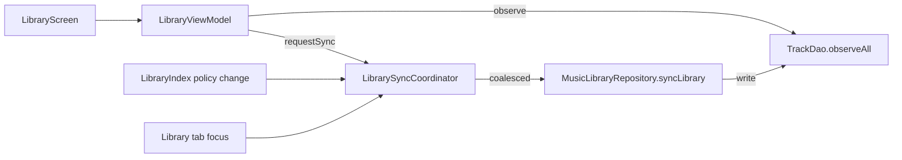

### User story

As a user, I want library indexing to run in the background and show my last-known library immediately when I open **Your Library**, so switching tabs never blocks on a long MediaStore scan.

### Description

Stories **01–10** ship `syncLibrary()`, Room caching, and index policy on ingest — but `getAllTracks()` still blocks on a full MediaStore walk when Library opens. This story adds **stale-while-revalidate**: paint Room cache first, refresh in background, merge when done.

**Prerequisite:** stories 01–10 (Room `TrackDao`, `syncLibrary()`, Library Index re-index on policy change).

### Goals & scope (2–3 days)

- **In scope**
  - **Cached first paint**: Library reads Room before starting MediaStore sync.
  - **Background sync**: `syncLibrary()` on Library tab focus (debounced) and when story 10/12 policy changes fire re-index — UI stays interactive.
  - **Progress feedback**: Non-blocking “Updating library…” + existing scan-summary snackbar.
  - **Coalescing**: One in-flight sync; rapid tab switches do not stack scans.
- **Out of scope**
  - Incremental MediaStore deltas.
  - WorkManager sync while app is killed.
  - Changing index policy or folder/artist rules (shipped / story 12).

### Acceptance criteria

- **AC1**: Warm cache (≥1 track) → list visible within **500 ms** without waiting for MediaStore.
- **AC2**: Background sync on Library open; no full-screen blocker for sync alone.
- **AC3**: Post-sync list matches MediaStore + current index policy without restart.
- **AC4**: Sync failure leaves cache visible + retry affordance.
- **AC5**: Only one concurrent `syncLibrary()`.

### Functional requirements

- **FR1**: Repository or coordinator exposes fast cached `Flow`/`List` from Room, then kicks off `syncLibrary()`.
- **FR2**: Library `ViewModel` states: `Ready(cached)` → `Refreshing` → `Ready(updated)`; cold empty cache uses existing empty/permission UI.
- **FR3**: Re-index hook from existing policy-change paths calls the same background coordinator (no duplicate scan triggers).
- **FR4**: On completion, update Room and emit `LibraryScanResult` to UI.

### Non-functional requirements

- **NFR1**: Initial list render **< 16 ms** main-thread work when cache exists.
- **NFR2**: Sync must not affect playback smoothness.
- **NFR3**: Single in-memory/Room source of truth — no duplicate full lists.

### UX design

- **First paint**: Current track list layout, cached data.
- **Refreshing**: Thin top indicator or subtitle — not modal.
- **Completion**: Reuse `scan_summary` snackbar (story 10).
- **Cold start**: Existing loading/empty only when Room is empty.

### Testing & validation

- **Unit**: ViewModel state machine; coalesced duplicate sync requests.
- **Integration**: Seed Room, slow MediaStore mock → list before mock returns.
- **Device**: 500+ tracks, time-to-first-row, no ANR on tab switch.

### Out of scope

- For You / other tabs cache strategy.
- Periodic background indexing.

---

### Overall app state after this story

**Your Library** feels instant on repeat visits while staying up to date silently.

### Value added after this story

Fixes the main performance pain called out in `features_to_refine.md` without reworking indexing rules already shipped in story 10.

---

## Implementation plan

### Current gap

Today `getAllTracks()` delegates to `syncLibrary()`, and `LibraryViewModel.loadLibrary()` blocks on both `scanMusicDirectories()` and `syncLibrary()` before painting anything:

```33:33:app/src/main/java/com/anplak/androidmusic/data/MusicLibraryRepository.kt
    override suspend fun getAllTracks(): List<TrackInfo> = syncLibrary().tracks
```

```67:85:app/src/main/java/com/anplak/androidmusic/ui/LibraryViewModel.kt
    fun loadLibrary() {
        if (hasLoaded) return
        viewModelScope.launch {
            _uiState.value = LibraryUiState.Loading
            // ... scanMusicDirectories + syncLibrary block here ...
            hasLoaded = true
            applyFilters()
        }
    }
```

Room cache is written during sync but never read on Library open.

### Architecture overview



**Layers (in build order):**

| Step | File(s) | Purpose |
|------|---------|---------|
| 1 | `TrackDao.kt`, `FavoritesRepository.kt` | Room read path + entity mapping (already exists) |
| 2 | `MusicLibraryRepository.kt` | Split cache read from sync |
| 3 | `LibrarySyncCoordinator.kt` *(new)* | Single in-flight sync, debounce, scan-once |
| 4 | `LibrarySyncCoordinatorFactory.kt` *(new)* | App-scoped singleton wiring |
| 5 | `LibraryViewModel.kt` | Stale-while-revalidate state machine |
| 6 | `LibraryScreen.kt`, `strings.xml` | Refresh indicator, error retry |
| 7 | `MusicPlayerApp.kt` | Tab-focus sync + policy-change hook |

---

### Step 1 — Repository: cache read without sync

**Change `MusicLibraryRepository` interface:**

```kotlin
interface MusicLibraryRepository {
    suspend fun getCachedTracks(): List<TrackInfo>
    fun observeCachedTracks(): Flow<List<TrackInfo>>   // optional but preferred
    suspend fun syncLibrary(): LibraryScanResult
    suspend fun scanMusicDirectories()
    // Deprecate blocking alias — callers migrate to getCachedTracks()
    suspend fun getAllTracks(): List<TrackInfo> = getCachedTracks()
}
```

**TrackDao addition:**

```kotlin
@Query("SELECT * FROM tracks ORDER BY title ASC")
fun observeAll(): Flow<List<TrackEntity>>
```

**Repository impl:**

```kotlin
override suspend fun getCachedTracks(): List<TrackInfo> =
    trackDao?.getAll().orEmpty().map { it.toTrackInfo() } ?: emptyList()

override fun observeCachedTracks(): Flow<List<TrackInfo>> =
    (trackDao?.observeAll() ?: flowOf(emptyList()))
        .map { entities -> entities.map { it.toTrackInfo() } }
```

**Rationale:** `syncLibrary()` already persists to Room (`insertAll` + `deleteStaleEntries`). Reading Room is the correct stale snapshot; no second in-memory list. Reuse existing `TrackEntity.toTrackInfo()` in `FavoritesRepository.kt`.

**Out-of-scope callers:** `PlaybackViewModel`, `PlaylistsViewModel`, and `RecommendationRepository` still call `getAllTracks()`. After this change they get cached data (acceptable — they don't need live MediaStore on every action). Explicit sync stays coordinator-owned.

---

### Step 2 — `LibrarySyncCoordinator` (coalescing + debounce)

New file: `app/src/main/java/com/anplak/androidmusic/data/LibrarySyncCoordinator.kt`

```kotlin
class LibrarySyncCoordinator(
    private val repository: MusicLibraryRepository,
    private val scope: CoroutineScope   // ApplicationScope or SupervisorJob + IO
) {
    private val syncMutex = Mutex()
    private var inFlight: Deferred<LibraryScanResult>? = null
    private var hasScannedDirectories = false

    private val _syncState = MutableStateFlow<LibrarySyncState>(LibrarySyncState.Idle)
    val syncState: StateFlow<LibrarySyncState> = _syncState.asStateFlow()

    private var debounceJob: Job? = null

    /** Debounced entry for tab focus (300 ms). */
    fun scheduleSync(debounceMs: Long = 300L) {
        debounceJob?.cancel()
        debounceJob = scope.launch {
            delay(debounceMs)
            syncNow()
        }
    }

    /** Immediate sync; coalesces concurrent callers (AC5). */
    suspend fun syncNow(): LibrarySyncResult = syncMutex.withLock {
        inFlight?.takeIf { it.isActive }?.let { active ->
            return@withLock LibrarySyncResult.Joined(await = active.await())
        }

        _syncState.value = LibrarySyncState.Running
        val deferred = scope.async(Dispatchers.IO) {
            if (!hasScannedDirectories) {
                repository.scanMusicDirectories()
                hasScannedDirectories = true
            }
            repository.syncLibrary()
        }
        inFlight = deferred

        try {
            val result = deferred.await()
            _syncState.value = LibrarySyncState.Success(result)
            LibrarySyncResult.Completed(result)
        } catch (e: Exception) {
            _syncState.value = LibrarySyncState.Failed(e)
            LibrarySyncResult.Failed(e)
        } finally {
            inFlight = null
        }
    }
}

sealed interface LibrarySyncState {
    data object Idle : LibrarySyncState
    data object Running : LibrarySyncState
    data class Success(val result: LibraryScanResult) : LibrarySyncState
    data class Failed(val error: Throwable) : LibrarySyncState
}

sealed interface LibrarySyncResult {
    data class Completed(val result: LibraryScanResult) : LibrarySyncResult
    data class Joined(val await: LibraryScanResult) : LibrarySyncResult   // joined in-flight sync
    data class Failed(val error: Throwable) : LibrarySyncResult
}
```

**Factory (app-scoped singleton):**

```kotlin
object LibrarySyncCoordinatorFactory {
    @Volatile private var instance: LibrarySyncCoordinator? = null

    fun get(context: Context): LibrarySyncCoordinator =
        instance ?: synchronized(this) {
            instance ?: LibrarySyncCoordinator(
                repository = MusicLibraryRepositoryFactory.create(context),
                scope = CoroutineScope(SupervisorJob() + Dispatchers.Default)
            ).also { instance = it }
        }
}
```

**Key decisions:**

| Decision | Rationale |
|----------|-----------|
| Coordinator owns `scanMusicDirectories()` | Keeps ViewModel thin; scan runs once per app session inside sync pipeline, not on every tab switch UI path |
| `Mutex` + shared `Deferred` | AC5 — second caller awaits same job instead of starting a second MediaStore walk |
| Debounce on tab focus, not on policy change | Rapid tab switches don't stack; `refresh()` / policy revert calls `syncNow()` directly |
| Application-scoped coordinator | Policy change (`MusicPlayerApp`) and Library tab share one coalescing point (FR3) |

---

### Step 3 — `LibraryViewModel` state machine

**Extend `LibraryUiState`:**

```kotlin
sealed interface LibraryUiState {
    data object Loading : LibraryUiState                          // cold empty cache only
    data object Empty : LibraryUiState
    data class Content(
        val tracks: List<TrackInfo>,
        val isRefreshing: Boolean = false,
        val syncFailed: Boolean = false,
        val favoriteIds: Set<Long> = emptySet(),
        val filter: LibraryFilter = LibraryFilter(),
        val localQuery: String = "",
        val showNoFilterResults: Boolean = false
    ) : LibraryUiState
}
```

**Replace `loadLibrary()` / `hasLoaded` with two entry points:**

```kotlin
fun onLibraryVisible() {
    scheduleBackgroundSync()   // debounced via coordinator
}

fun refresh() {
    viewModelScope.launch {
        if (currentTracks.isEmpty()) _uiState.value = LibraryUiState.Loading
        runSync(showSummary = true)
    }
}

init {
    viewModelScope.launch {
        repository.observeCachedTracks().collect { cached ->
            currentTracks = cached
            recentlyAddedIds = loadRecentlyAddedIds()
            applyFilters(isRefreshing = syncCoordinator.syncState.value is LibrarySyncState.Running)
        }
    }
    viewModelScope.launch {
        syncCoordinator.syncState.collect { state ->
            when (state) {
                is LibrarySyncState.Running -> markRefreshing(true)
                is LibrarySyncState.Success -> {
                    markRefreshing(false)
                    _scanSummary.value = state.result
                }
                is LibrarySyncState.Failed -> markRefreshing(false, failed = true)
                Idle -> Unit
            }
        }
    }
    viewModelScope.launch {
        // First paint: if cache empty, cold-start sync blocks Loading → Content/Empty
        if (repository.getCachedTracks().isEmpty()) {
            _uiState.value = LibraryUiState.Loading
            runSync(showSummary = true)
        } else {
            applyFilters()   // AC1 — list visible immediately from Room Flow
            scheduleBackgroundSync()
        }
    }
}
```

**Remove `hasLoaded` gate** — cache Flow is always live; sync is orthogonal.

**Rationale:** Matches FR2 `Ready(cached) → Refreshing → Ready(updated)`. `Loading` full-screen spinner only when Room is empty (cold start). Warm cache paints via Flow emission before sync completes (NFR1 — filter work stays on collected list, no MediaStore on main thread).

---

### Step 4 — UI changes (`LibraryScreen`)

**Tab focus hook** — replace one-shot `LaunchedEffect(Unit)`:

```kotlin
// LibraryScreen.kt
LaunchedEffect(Unit) { viewModel.onLibraryVisible() }

// MusicPlayerApp.kt — also trigger when user switches to Library tab
NavigationBarItem(/* ... */ onClick = {
    onTabSelected(tab)
    if (tab == NavigationTab.Library) libraryViewModel.onLibraryVisible()
})
```

**Non-blocking refresh indicator** — show when `Content.isRefreshing`:

```kotlin
is LibraryUiState.Content -> {
    Column(Modifier.fillMaxSize()) {
        if (state.isRefreshing) {
            LinearProgressIndicator(
                modifier = Modifier
                    .fillMaxWidth()
                    .testTag("library_refresh_indicator")
            )
            // or subtitle under TopAppBar: stringResource(R.string.updating_library)
        }
        if (state.syncFailed) {
            TextButton(onClick = { viewModel.refresh() }) {
                Text(stringResource(R.string.library_sync_retry))
            }
        }
        // existing filter bar + track list unchanged
    }
}
```

**New strings:**

```xml
<string name="updating_library">Updating library…</string>
<string name="library_sync_retry">Couldn\'t update library. Tap to retry.</string>
```

**Keep** existing `scan_summary` snackbar on sync success (story 10). **Do not** show full-screen `LoadingState` when `Content.isRefreshing` (AC2).

**Cold start:** unchanged `LoadingState` + `scanning_library` when `uiState is Loading`.

---

### Step 5 — Policy-change re-index hook (FR3)

`MusicPlayerApp` already calls `libraryViewModel.refresh()` when index rules change:

```175:177:app/src/main/java/com/anplak/androidmusic/ui/MusicPlayerApp.kt
                            if (libraryIndexViewModel.consumeRulesChanged()) {
                                libraryViewModel.refresh()
                            }
```

**Change `refresh()`** to call `syncCoordinator.syncNow()` (not reset `hasScanned`) — cache stays visible, list updates when Room Flow emits post-sync. Story 12 will reuse the same path for artist-exclusion changes.

---

### Step 6 — Threading & performance notes

- All MediaStore / file scan work stays in `Dispatchers.IO` inside `syncLibrary()` (already true).
- ViewModel collects Room Flow on `viewModelScope` (main-safe); mapping + filter in `applyFilters()` operates on already-loaded list — target < 16 ms for 500 tracks (NFR2/NFR3).
- Coordinator uses `SupervisorJob` so sync failure doesn't cancel cache observation.

---

### Migration checklist

- [ ] `TrackDao.observeAll()` + repository `observeCachedTracks()`
- [ ] `getAllTracks()` → cache-only; update interface + fakes
- [ ] `LibrarySyncCoordinator` + factory
- [ ] `LibraryViewModel` refactor (remove `hasLoaded`, add `isRefreshing` / `syncFailed`)
- [ ] `LibraryScreen` refresh indicator + retry affordance
- [ ] `MusicPlayerApp` tab-focus debounced sync
- [ ] `strings.xml` — `updating_library`, `library_sync_retry`
- [ ] Update `LibraryViewModelTest` fakes to seed cache via `FakeTrackDao`
- [ ] Adjust `LibraryScreenE2ETest` — warm cache should **not** require loading spinner

---

### Test scenarios

**Unit — ViewModel**
- Warm cache: after seeding `FakeTrackDao`, `Content` emitted before sync completes; `isRefreshing = true` during sync.
- Cold cache: `Loading` until first sync; then `Content` or `Empty`.
- Coalescing: two rapid `onLibraryVisible()` → coordinator `syncLibrary` called once.
- Sync failure: cache remains visible, `syncFailed = true`; `refresh()` retries.
- Policy refresh: `refresh()` updates list without returning to `Loading` when cache non-empty.

**Unit — Coordinator**
- Concurrent `syncNow()` from two coroutines → single `syncLibrary` invocation, both receive same result.
- `scheduleSync` debounce: three calls within 300 ms → one sync.

**Integration**
- Seed Room with N tracks, mock slow `syncLibrary` (delay 2 s) → assert track list visible within 500 ms; list count updates after sync.

**Device / E2E**
- Library with 500+ tracks: time-to-first-row < 500 ms on second visit.
- Tab switch For You ↔ Library repeatedly: no ANR, no stacked progress modals.
- Change folder exclusion in Library Index → return to Library → list updates after background sync without manual restart.
