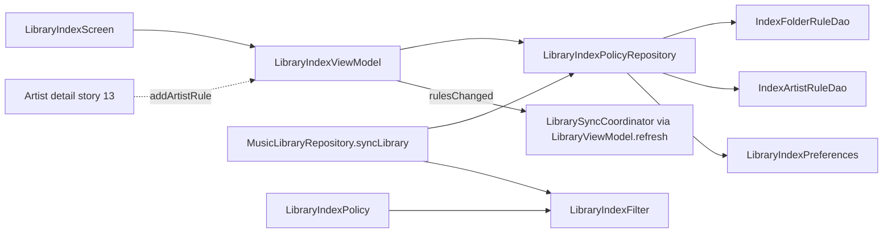

### User story

As a user, I want to **exclude artists** from my library index and **review or revert** all exclusions (folders and artists), so unwanted content stays out while mistakes are easy to undo.

### Description

Stories **01–10** already ship duration cap, folder include/exclude rules, `syncLibrary()`, and the Library Index settings screen. This story adds the **remaining index-management gaps**: **artist blocklist**, a unified **active exclusions list**, and **per-rule revert** (remove rule → re-index). No rework of existing folder or duration policy logic.

**Prerequisite:** stories 01–10 (especially story 10 library indexing rules).

### Goals & scope (2–3 days)

- **In scope**
  - **Artist exclude rules**: Blocklist by artist name; matching tracks skipped during `syncLibrary()` (case-insensitive).
  - **Exclusions list**: Extend Library Index UI with sections listing **active** excluded folders and excluded artists (read from existing folder-rule storage + new artist-rule storage).
  - **Revert**: Per-row remove restores inclusion on next sync (story 11 background path).
  - **Add artist rule**: From Library Index and from artist detail (story 13) overflow menu.
  - **Persistence**: Artist rules in Room (same pattern as `IndexFolderRuleEntity`).
- **Out of scope**
  - Folder include/exclude or duration cap (already shipped).
  - Include-only artist whitelist.
  - Fuzzy artist matching (“feat.” splits).
  - Per-track or per-album exclusion.

### Acceptance criteria

- **AC1**: User can add an artist exclusion from Library Index or artist detail; duplicate rules are idempotent.
- **AC2**: After excluding an artist, their tracks disappear from Library and downstream surfaces on next sync.
- **AC3**: Exclusions screen lists every active folder-exclude and artist-exclude rule with a remove action.
- **AC4**: Removing any rule and re-syncing restores matching tracks (if they pass duration/folder policy).
- **AC5**: Favorites/playlists with excluded track IDs degrade gracefully (no crash).

### Functional requirements

- **FR1**: `LibraryIndexPolicy` and `LibraryIndexFilter` extended for artist excludes only.
- **FR2**: `LibraryIndexPolicyRepository` CRUD for artist rules; `loadPolicy()` merges with existing folder rules.
- **FR3**: Library Index UI gains “Excluded artists” section and “Excluded folders” list with remove — **no redesign** of existing add-folder or duration UI.
- **FR4**: Rule add/remove triggers existing re-index flow via story 11 coordinator.
- **FR5**: `LibraryScanResult` optionally reports `skippedArtistCount` (or folds into folder skip metric with log distinction).

### Non-functional requirements

- **NFR1**: Artist match is O(rules) per track.
- **NFR2**: Rule persistence completes before re-index starts.
- **NFR3**: Re-index stays non-blocking per story 11.

### UX design

- **Entry points**: Existing Library Index screen; artist detail ⋮ → “Exclude artist from library” (after story 13).
- **Exclusions list**: Path or artist name, “Excluded” label, remove icon per row.
- **Add artist**: Autocomplete from distinct artists in Room cache.
- **Empty state**: “No exclusions” when both lists empty.
- **Feedback**: Reuse existing scan-summary snackbar on revert.

### Testing & validation

- **Unit**: `LibraryIndexFilter` artist exclude + interaction with existing folder rules.
- **Unit**: Artist rule repository insert/delete.
- **Integration**: Exclude → sync → count drops; remove → tracks return.
- **E2E**: Extend `LibraryIndexE2ETest` for artist exclude + list + revert only.

### Out of scope

- Re-implementing folder picker, duration slider, or `syncLibrary()` ingest.
- Cross-device rule sync.

---

### Overall app state after this story

Users can block **artists** and see **every active exclusion** in one place, with one-tap revert — completing the index-management vision from `features_to_refine.md`.

### Value added after this story

Podcast folders and one-off artists stay out of shuffle and browse views; reversibility reduces fear of over-filtering.

---

## Implementation plan

### Current gap

Story 10 ships duration cap, folder include/exclude rules, and `LibraryIndexFilter.shouldIndex(filePath, duration, policy)` — but **artist is never passed** into the filter, and there is no Room table or UI for artist blocklist. The Library Index screen lists all folder rules in one section with no dedicated exclusions view and no way to add/remove artist rules.

```5:6:app/src/main/java/com/anplak/androidmusic/data/LibraryIndexPolicy.kt
    val maxDurationMs: Long = DEFAULT_MAX_INDEX_DURATION_MS,
    val folderRules: List<FolderRule> = emptyList()
```

```171:176:app/src/main/java/com/anplak/androidmusic/data/MusicLibraryRepository.kt
                        if (!LibraryIndexFilter.shouldIndex(filePath, duration, policy)) {
                            when {
                                duration <= 0 || duration > policy.maxDurationMs -> skippedDuration++
                                else -> skippedFolder++
                            }
                            continue
                        }
```

Revert/re-index wiring already exists via story 11 — policy changes set `rulesChanged` and call `libraryViewModel.refresh()` on back navigation:

```175:177:app/src/main/java/com/anplak/androidmusic/ui/MusicPlayerApp.kt
                            if (libraryIndexViewModel.consumeRulesChanged()) {
                                libraryViewModel.refresh()
                            }
```

Story 12 plugs into that path; no new coordinator work.

### Architecture overview



**Layers (in build order):**

| Step | File(s) | Purpose |
|------|---------|---------|
| 1 | `IndexArtistRuleEntity.kt`, `IndexArtistRuleDao.kt`, `AppDatabase.kt` | Room persistence (mirror folder rules) |
| 2 | `LibraryIndexPolicy.kt`, `LibraryIndexFilter.kt` | Policy model + artist exclude evaluation |
| 3 | `LibraryIndexPolicyRepository.kt` | Artist CRUD; `loadPolicy()` merge |
| 4 | `MusicLibraryRepository.kt`, `LibraryScanResult.kt` | Pass artist into filter; `skippedArtistCount` |
| 5 | `TrackDao.kt` | `getDistinctArtists()` for autocomplete |
| 6 | `LibraryIndexViewModel.kt`, `LibraryIndexScreen.kt`, `strings.xml` | Exclusions UI + add-artist dialog |
| 7 | `MusicPlayerApp.kt` | Story 13 hook stub for artist-detail exclude |

---

### Step 1 — Room: artist rule entity + migration

**New entity** (mirror `IndexFolderRuleEntity` — exclude-only, no mode column):

```kotlin
@Entity(tableName = "index_artist_rules")
data class IndexArtistRuleEntity(
    @PrimaryKey
    val name: String   // normalized: trim + lowercase (PK enforces case-insensitive idempotency)
)
```

**New DAO:**

```kotlin
@Dao
interface IndexArtistRuleDao {
    @Query("SELECT * FROM index_artist_rules ORDER BY name COLLATE NOCASE ASC")
    suspend fun getAll(): List<IndexArtistRuleEntity>

    @Insert(onConflict = OnConflictStrategy.IGNORE)   // AC1 — duplicate add is no-op
    suspend fun insert(rule: IndexArtistRuleEntity): Long

    @Query("DELETE FROM index_artist_rules WHERE name = :name")
    suspend fun deleteByName(name: String)

    @Query("DELETE FROM index_artist_rules")
    suspend fun deleteAll()
}
```

**Migration 4 → 5** in `AppDatabase.kt`:

```kotlin
private val MIGRATION_4_5 = object : Migration(4, 5) {
    override fun migrate(db: SupportSQLiteDatabase) {
        db.execSQL("""
            CREATE TABLE IF NOT EXISTS index_artist_rules (
                name TEXT NOT NULL PRIMARY KEY
            )
        """)
    }
}
```

**Rationale:** Same persistence pattern as folder rules (FR2). Lowercase PK avoids duplicate `"Podcast"` / `"podcast"` rows and makes lookup O(1) per rule at query time. `OnConflictStrategy.IGNORE` satisfies AC1 idempotency without extra read-before-write.

---

### Step 2 — Policy model + filter extension

**Extend `LibraryIndexPolicy`:**

```kotlin
data class ArtistRule(val name: String)

data class LibraryIndexPolicy(
    val maxDurationMs: Long = DEFAULT_MAX_INDEX_DURATION_MS,
    val folderRules: List<FolderRule> = emptyList(),
    val artistRules: List<ArtistRule> = emptyList()
)
```

**Extend `LibraryIndexFilter`** — add artist parameter; preserve existing folder/duration order (duration → folder → artist → include whitelist):

```kotlin
object LibraryIndexFilter {

    fun normalizeArtist(name: String): String = name.trim().lowercase()

    fun skipReason(
        filePath: String,
        durationMs: Long,
        artist: String,
        policy: LibraryIndexPolicy
    ): IndexSkipReason? {
        if (durationMs <= 0 || durationMs > policy.maxDurationMs) return IndexSkipReason.DURATION

        val normalized = normalizePath(filePath)
        if (normalized.isEmpty()) {
            val includes = policy.folderRules.filter { it.mode == FolderRuleMode.INCLUDE }
            if (includes.isNotEmpty()) return IndexSkipReason.FOLDER
        } else {
            val excludes = policy.folderRules.filter { it.mode == FolderRuleMode.EXCLUDE }
            if (excludes.any { normalized.startsWith(normalizePath(it.path)) }) {
                return IndexSkipReason.FOLDER
            }
            val includes = policy.folderRules.filter { it.mode == FolderRuleMode.INCLUDE }
            if (includes.isNotEmpty() &&
                !includes.any { normalized.startsWith(normalizePath(it.path)) }
            ) {
                return IndexSkipReason.FOLDER
            }
        }

        val normalizedArtist = normalizeArtist(artist)
        if (normalizedArtist.isNotEmpty() &&
            policy.artistRules.any { normalizeArtist(it.name) == normalizedArtist }
        ) {
            return IndexSkipReason.ARTIST
        }
        return null
    }

    fun shouldIndex(
        filePath: String,
        durationMs: Long,
        artist: String,
        policy: LibraryIndexPolicy
    ): Boolean = skipReason(filePath, durationMs, artist, policy) == null
}

enum class IndexSkipReason { DURATION, FOLDER, ARTIST }
```

**Key decisions:**

| Decision | Rationale |
|----------|-----------|
| Exact case-insensitive match on full artist string | FR scope — no fuzzy/feat. splitting |
| Artist check **after** folder rules | Folder exclude is path-based and cheaper; artist rules are O(rules) per track (NFR1) |
| `skipReason` enum instead of boolean | FR5 — accurate `skippedArtistCount` without duplicating filter logic in repository |
| Keep `shouldIndex` as convenience | Existing tests/callers migrate with one new param |

---

### Step 3 — Repository CRUD

**Extend `LibraryIndexPolicyRepository`:**

```kotlin
class LibraryIndexPolicyRepository(
    private val preferences: LibraryIndexPreferences,
    private val folderRuleDao: IndexFolderRuleDao,
    private val artistRuleDao: IndexArtistRuleDao   // new
) {
    suspend fun loadPolicy(): LibraryIndexPolicy {
        return LibraryIndexPolicy(
            maxDurationMs = preferences.getMaxDurationMs(),
            folderRules = folderRuleDao.getAll().map { it.toFolderRule() },
            artistRules = artistRuleDao.getAll().map { ArtistRule(it.name) }
        )
    }

    suspend fun getArtistRules(): List<ArtistRule> =
        artistRuleDao.getAll().map { ArtistRule(it.name) }

    suspend fun addArtistRule(name: String) {
        val normalized = LibraryIndexFilter.normalizeArtist(name)
        if (normalized.isEmpty()) return
        artistRuleDao.insert(IndexArtistRuleEntity(name = normalized))
    }

    suspend fun removeArtistRule(name: String) {
        artistRuleDao.deleteByName(LibraryIndexFilter.normalizeArtist(name))
    }
}
```

Wire `IndexArtistRuleDao` in ViewModel/factory constructors alongside existing `indexFolderRuleDao()`.

**Rationale:** `loadPolicy()` remains the single merge point (FR2). Normalization lives in repository on write/delete so DAO keys always match filter lookup. Rule persistence completes in the ViewModel coroutine **before** `rulesChanged = true` (NFR2) — same pattern as `addFolderRule`.

---

### Step 4 — Sync ingest + scan result

**`MusicLibraryRepository.syncLibrary`** — pass artist, use `skipReason`:

```kotlin
var skippedArtist = 0

// inside cursor loop, after reading artist:
when (LibraryIndexFilter.skipReason(filePath, duration, artist, policy)) {
    IndexSkipReason.DURATION -> { skippedDuration++; continue }
    IndexSkipReason.FOLDER -> { skippedFolder++; continue }
    IndexSkipReason.ARTIST -> { skippedArtist++; continue }
    null -> { /* index track */ }
}

Log.d(TAG, "... $skippedArtist skipped (artist) ...")

return LibraryScanResult(
    tracks = tracks,
    indexedCount = tracks.size,
    skippedDurationCount = skippedDuration,
    skippedFolderCount = skippedFolder,
    skippedArtistCount = skippedArtist
)
```

**Extend `LibraryScanResult`:**

```kotlin
data class LibraryScanResult(
    val tracks: List<TrackInfo>,
    val indexedCount: Int,
    val skippedDurationCount: Int,
    val skippedFolderCount: Int,
    val skippedArtistCount: Int = 0
)
```

**Update scan-summary string** (`strings.xml` + `LibraryScreen.kt`):

```xml
<string name="scan_summary">Indexed %1$d · Skipped %2$d (long) · %3$d (folder) · %4$d (artist)</string>
```

**Rationale:** `deleteStaleEntries` after sync removes excluded artists from Room cache — Library and downstream tabs update via existing `observeCachedTracks()` Flow (AC2). Separate metric keeps logs/snackbar distinguishable (FR5) without folding into folder count.

---

### Step 5 — TrackDao distinct artists (autocomplete source)

```kotlin
@Query("""
    SELECT DISTINCT artist FROM tracks
    WHERE artist != '' AND artist != 'Unknown Artist'
    ORDER BY artist COLLATE NOCASE ASC
""")
suspend fun getDistinctArtists(): List<String>
```

**Rationale:** Autocomplete from Room cache (UX spec) — fast, no MediaStore walk. Only previously indexed artists appear; user can still type a new name manually if artist has zero cached tracks yet. Exclude sentinel values matching `getStringOrDefault` defaults.

---

### Step 6 — Library Index UI + ViewModel

**Extend `LibraryIndexUiState`:**

```kotlin
data class LibraryIndexUiState(
    val maxDurationMinutes: Int = ...,
    val includeFolderRules: List<FolderRule> = emptyList(),   // INCLUDE mode only
    val excludedFolders: List<FolderRule> = emptyList(),      // EXCLUDE mode only
    val excludedArtists: List<ArtistRule> = emptyList(),
    val knownArtists: List<String> = emptyList(),             // for autocomplete
    val presetFolders: List<String> = emptyList(),
    val rulesChanged: Boolean = false
)
```

**ViewModel additions** (mirror folder rule methods):

```kotlin
fun addArtistRule(name: String) {
    viewModelScope.launch {
        policyRepository.addArtistRule(name)
        refreshRules(markChanged = true)
    }
}

fun removeArtistRule(name: String) {
    viewModelScope.launch {
        policyRepository.removeArtistRule(name)
        refreshRules(markChanged = true)
    }
}

private suspend fun refreshRules(markChanged: Boolean) {
    val folderRules = policyRepository.getFolderRules()
    _uiState.update {
        it.copy(
            includeFolderRules = folderRules.filter { r -> r.mode == FolderRuleMode.INCLUDE },
            excludedFolders = folderRules.filter { r -> r.mode == FolderRuleMode.EXCLUDE },
            excludedArtists = policyRepository.getArtistRules(),
            knownArtists = trackDao.getDistinctArtists(),
            rulesChanged = it.rulesChanged || markChanged
        )
    }
}
```

**Screen layout** (additive — duration + add-folder dialog unchanged):

1. Max track duration row *(unchanged)*
2. **Folder rules** — show `includeFolderRules` only (whitelist entries)
3. **Excluded folders** — list EXCLUDE rules with remove icon + "Excluded" supporting text
4. **Excluded artists** — section header + add button → autocomplete dialog; list with remove
5. **Empty exclusions** — when both excluded lists empty: `stringResource(R.string.no_exclusions)`

Reuse `FolderRuleItem` pattern for artist rows (`ArtistRuleItem`). Add `ExposedDropdownMenuBox` or filtered `LazyColumn` in `AddArtistRuleDialog`:

```kotlin
@Composable
private fun AddArtistRuleDialog(
    knownArtists: List<String>,
    onDismiss: () -> Unit,
    onAdd: (String) -> Unit
) {
    var query by remember { mutableStateOf("") }
    val suggestions = remember(query, knownArtists) {
        knownArtists.filter { it.contains(query, ignoreCase = true) }.take(20)
    }
    // TextField + suggestion list; confirm adds trimmed query or selected suggestion
}
```

**New strings (representative):**

```xml
<string name="excluded_folders">Excluded folders</string>
<string name="excluded_artists">Excluded artists</string>
<string name="excluded_label">Excluded</string>
<string name="no_exclusions">No exclusions</string>
<string name="add_artist_rule">Exclude artist</string>
<string name="remove_artist_rule">Remove artist exclusion</string>
<string name="exclude_artist_from_library">Exclude artist from library</string>
```

**Key decisions:**

| Decision | Rationale |
|----------|-----------|
| Split folder list into include vs exclude sections | AC3 unified exclusions view without removing existing add-folder flow (FR3) |
| Add-artist button in Excluded artists section, not top bar | Keeps top-bar add-folder unchanged (FR3 "no redesign") |
| `rulesChanged` reuses existing back-navigation refresh | FR4 — same coordinator path as folder/duration changes |

---

### Step 7 — Story 13 hook (artist detail entry point)

Artist detail screen is out of scope until story 13, but AC1 requires that entry point. Add a **public ViewModel method** now and wire when story 13 lands:

```kotlin
// LibraryIndexViewModel — already exposed as addArtistRule(name)

// MusicPlayerApp.kt (when ArtistDetailScreen exists):
ArtistDetailScreen(
    onExcludeArtist = { artistName ->
        libraryIndexViewModel.addArtistRule(artistName)
        libraryViewModel.refresh()   // immediate re-index; also set rulesChanged if navigating via Index screen
    }
)
```

If exclude is triggered from artist detail without visiting Library Index, call `libraryViewModel.refresh()` directly (same as policy revert snackbar path).

---

### Step 8 — AC5 graceful degradation (favorites / playlists)

No new code required if sync pipeline is correct:

- `deleteStaleEntries` removes excluded tracks from `tracks` table.
- `FavoriteDao.getAllFavorites()` and `PlaylistDao.getPlaylistTracks()` use `INNER JOIN tracks` — excluded tracks **drop out of UI lists** without crash.
- Orphan `favorites` / `playlist_tracks` rows may remain; `FavoritesRepository.toggleFavorite(trackId)` already handles missing cache gracefully.

Optional hardening (only if tests reveal issues): periodic orphan cleanup — **out of scope** unless AC5 fails in integration.

---

### Migration checklist

- [ ] `IndexArtistRuleEntity`, `IndexArtistRuleDao`, `AppDatabase` v5 + `MIGRATION_4_5`
- [ ] `ArtistRule` + `artistRules` on `LibraryIndexPolicy`
- [ ] `LibraryIndexFilter.skipReason` / artist-aware `shouldIndex`
- [ ] `LibraryIndexPolicyRepository` artist CRUD + constructor wiring
- [ ] `MusicLibraryRepository` artist skip + log
- [ ] `LibraryScanResult.skippedArtistCount` + `scan_summary` string
- [ ] `TrackDao.getDistinctArtists()`
- [ ] `LibraryIndexViewModel` + `LibraryIndexScreen` exclusions sections + add-artist dialog
- [ ] Update fakes/tests constructors for new DAO param + `LibraryScanResult` field
- [ ] Story 13: wire `onExcludeArtist` when artist detail ships

---

### Test scenarios

**Unit — `LibraryIndexFilter`**
- Artist excluded (case-insensitive `"Podcast"` vs `"PODCAST"`) → `IndexSkipReason.ARTIST`.
- Artist excluded but folder include whitelist blocks path → `FOLDER` wins (checked first).
- Duration over cap → `DURATION` even if artist also blocklisted.

**Unit — `LibraryIndexPolicyRepository`**
- `addArtistRule` persists; duplicate insert ignored (AC1).
- `removeArtistRule` case-insensitive; `loadPolicy()` includes artist rules.

**Unit — `MusicLibraryRepository`**
- Sync with artist rule → matching tracks omitted from result; `skippedArtistCount` incremented; stale entries deleted from Room.

**Integration**
- Seed MediaStore mock tracks for artist "Podcast Host" → add exclude rule → sync → track count drops.
- Remove rule → sync → tracks reappear (if folder/duration pass).

**E2E — `LibraryIndexE2ETest`**
- Open Library Index → Excluded artists section visible.
- Add artist exclusion via dialog → back to Library → track count decreases after sync snackbar.
- Remove exclusion from list → re-sync → tracks return.
- Revert excluded folder from Excluded folders section (existing flow, now in dedicated list).
