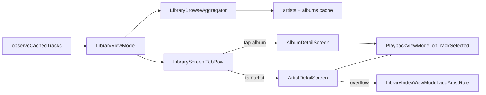

### User story

As a user, I want to browse my library by **Tracks**, **Artists**, and **Albums** so I can explore my collection by how I think about music, not only as a flat song list.

### Description

The Library tab today is a single track list over the indexed Room catalog. This story adds **in-library browse tabs** and **artist/album detail** screens — pure aggregation and navigation over data already indexed by stories **02** and **10**, loaded via story **11** cache-first path.

**Prerequisite:** stories 01–10; story **11** (cached library load); story **12** optional for artist-detail exclude entry point.

### Goals & scope (2–3 days)

- **In scope**
  - **Sub-tabs**: Tracks (current list) | Artists | Albums; keep existing toolbar (search, Library Index).
  - **Artists view**: Distinct artists, track count, tap → artist detail (tracks for artist).
  - **Albums view**: Album title + artist subtitle, tap → album detail (tracks in album).
  - **Detail screens**: Track list, play-on-tap, “Play all”.
  - **Empty states** per tab when catalog empty.
- **Out of scope**
  - MediaStore scan or index-policy changes (shipped).
  - Cover art grids (placeholder initials OK).
  - Sort/filter beyond default alphabetical.
  - Compilation / Various Artists heuristics.

### Acceptance criteria

- **AC1**: Three tabs; switching tabs does **not** start a new `syncLibrary()`.
- **AC2**: Artists tab lists distinct artists from Room with correct counts.
- **AC3**: Albums tab groups by album metadata; detail shows matching tracks.
- **AC4**: Play and Play all use existing `PlaybackViewModel` APIs.
- **AC5**: Tab state survives rotation.

### Functional requirements

- **FR1**: ViewModel aggregates artists/albums from cached `TrackInfo` / Room (IO thread).
- **FR2**: Artist detail: case-insensitive artist match; album detail: album (+ artist when homonyms exist).
- **FR3**: Reads catalog via story 11 fast path; reflects post-sync updates when background refresh completes.
- **FR4**: Artist detail overflow wires to story 12 exclude action when that story is shipped.

### Non-functional requirements

- **NFR1**: Aggregation for 5,000 tracks **< 200 ms** off main thread.
- **NFR2**: Tab switch **< 100 ms** when aggregation cached in ViewModel.
- **NFR3**: `LazyColumn` with stable keys.

### UX design

- **Tabs**: Material3 `TabRow` under Library top bar.
- **Rows**: Artist — name + “N tracks”; Album — title + artist.
- **Detail**: Header + Play all; track rows match existing Library row style.
- **Refreshing**: Inline indicator from story 11 only — no new loading patterns.

### Testing & validation

- **Unit**: Aggregation — duplicates, blank artist, homonymous albums.
- **Compose**: Tab switch, navigation, Play all queue order.
- **Integration**: After story 11 background sync, artist/album counts update.

### Out of scope

- Artist/folder exclusion logic (story 12).
- Metadata editing.
- Album grid layout.

---

### Overall app state after this story

Library supports **three browse lenses** on the same indexed catalog, without new scan or policy work.

### Value added after this story

Large libraries are easier to navigate; artist detail also becomes the natural entry point for artist exclusion (story 12).

---

## Implementation plan

### Current gap

`LibraryScreen` is a single flat `TrackList` fed by `LibraryViewModel.applyFilters()` over `repository.observeCachedTracks()`. There are no browse sub-tabs, no artist/album aggregation, and no detail screens. Navigation today only pushes full-screen routes via `AppScreen` (playlist, search, library index) — not in-library drill-down.

```138:177:app/src/main/java/com/anplak/androidmusic/ui/LibraryScreen.kt
            when (val state = uiState) {
                is LibraryUiState.Loading -> LoadingState()
                is LibraryUiState.Empty -> EmptyLibraryState()
                is LibraryUiState.Content -> {
                    Column(modifier = Modifier.fillMaxSize()) {
                        // ... refresh indicator, filter bar ...
                        TrackList(
                            tracks = state.tracks,
                            // ...
                        )
                    }
                }
            }
```

```74:82:app/src/main/java/com/anplak/androidmusic/ui/LibraryViewModel.kt
        viewModelScope.launch {
            repository.observeCachedTracks().collect { cached ->
                currentTracks = cached
                recentlyAddedIds = loadRecentlyAddedIds()
                if (shouldApplyFilters()) {
                    applyFilters()
                }
            }
        }
```

Story 11 cache-first path and story 12 artist exclude are already wired; this story is **pure aggregation + UI** on top of the same `TrackInfo` stream.

### Architecture overview



**Layers (in build order):**

| Step | File(s) | Purpose |
|------|---------|---------|
| 1 | `LibraryBrowseAggregator.kt`, model types | Pure aggregation off main thread (FR1, NFR1) |
| 2 | `LibraryViewModel.kt` | Tab state, aggregate cache, detail track lookup |
| 3 | `LibraryScreen.kt` | `TabRow` + Artists/Albums lists; filter bar on Tracks only |
| 4 | `LibraryArtistDetailScreen.kt`, `LibraryAlbumDetailScreen.kt` | Detail header, Play all, track list |
| 5 | `MusicPlayerApp.kt`, `AppScreen` | Push/pop detail routes; story 12 exclude hook |
| 6 | `strings.xml` | Tab labels, track counts, empty states |

---

### Step 1 — Aggregation layer (`LibraryBrowseAggregator`)

New pure-Kotlin object in `data/` — no Room queries. FR1 requires aggregation from cached `TrackInfo`; the ViewModel already holds the full catalog via `observeCachedTracks()`, so in-memory grouping avoids extra DAO surface and stays consistent with filter semantics.

```kotlin
data class ArtistSummary(
    val displayName: String,   // first-seen casing for UI
    val normalizedKey: String, // LibraryIndexFilter.normalizeArtist
    val trackCount: Int
)

data class AlbumSummary(
    val displayTitle: String,
    val displayArtist: String,   // subtitle in list row
    val normalizedTitle: String,
    val normalizedArtist: String, // empty when homonym disambiguation not needed
    val trackCount: Int
)

object LibraryBrowseAggregator {

    fun aggregateArtists(tracks: List<TrackInfo>): List<ArtistSummary> {
        val groups = tracks.groupBy { normalizeArtistKey(it.artist) }
        return groups.map { (key, group) ->
            ArtistSummary(
                displayName = displayArtistName(group.first().artist),
                normalizedKey = key,
                trackCount = group.size
            )
        }.sortedBy { it.displayName.lowercase() }
    }

    fun aggregateAlbums(tracks: List<TrackInfo>): List<AlbumSummary> {
        val homonyms = findHomonymAlbumTitles(tracks)
        val groups = tracks.groupBy { albumGroupKey(it, homonyms) }
        return groups.map { (_, group) ->
            val first = group.first()
            val title = first.album.ifBlank { UNKNOWN_ALBUM }
            val artist = first.artist.ifBlank { UNKNOWN_ARTIST }
            val needsArtist = homonyms.contains(title.trim().lowercase())
            AlbumSummary(
                displayTitle = title,
                displayArtist = artist,
                normalizedTitle = title.trim().lowercase(),
                normalizedArtist = if (needsArtist) normalizeArtistKey(artist) else "",
                trackCount = group.size
            )
        }.sortedWith(compareBy({ it.displayTitle.lowercase() }, { it.displayArtist.lowercase() }))
    }

    fun tracksForArtist(tracks: List<TrackInfo>, normalizedKey: String): List<TrackInfo> =
        tracks.filter { normalizeArtistKey(it.artist) == normalizedKey }
            .sortedBy { it.title.lowercase() }

    fun tracksForAlbum(
        tracks: List<TrackInfo>,
        normalizedTitle: String,
        normalizedArtist: String
    ): List<TrackInfo> =
        tracks.filter { track ->
            val title = track.album.ifBlank { UNKNOWN_ALBUM }.trim().lowercase()
            val artist = normalizeArtistKey(track.artist)
            title == normalizedTitle &&
                (normalizedArtist.isEmpty() || artist == normalizedArtist)
        }.sortedBy { it.title.lowercase() }

    private fun normalizeArtistKey(artist: String): String =
        LibraryIndexFilter.normalizeArtist(artist.ifBlank { UNKNOWN_ARTIST })

    private fun findHomonymAlbumTitles(tracks: List<TrackInfo>): Set<String> { /* ... */ }
}
```

**Key decisions:**

| Decision | Rationale |
|----------|-----------|
| In-memory aggregation, not new `TrackDao` GROUP BY | Same source as track list; auto-updates when `observeCachedTracks()` emits (FR3). `getDistinctArtists()` exists for story 12 autocomplete but is not the browse data path. |
| Reuse `LibraryIndexFilter.normalizeArtist` | Case-insensitive artist match (FR2) aligns with story 12 exclude rules. |
| `displayName` = first track's casing | Alphabetical sort on lowercase; UI shows natural casing without heuristics. |
| Album homonym detection via duplicate lowercase titles | FR2 — artist only part of detail key when multiple artists share a title; list always shows artist subtitle (UX). |
| Blank artist → `Unknown Artist` | Matches `LibraryIndexSuggestions.UNKNOWN_ARTIST_LABEL` and `TrackDao.getDistinctArtists()` filter. |

---

### Step 2 — Extend `LibraryViewModel`

Add browse tab + cached aggregates. Tab switch must **not** call `syncCoordinator` (AC1).

```kotlin
enum class LibraryBrowseTab { Tracks, Artists, Albums }

data class Content(
  // existing fields ...
  val browseTab: LibraryBrowseTab = LibraryBrowseTab.Tracks,
  val artists: List<ArtistSummary> = emptyList(),
  val albums: List<AlbumSummary> = emptyList(),
) : LibraryUiState

class LibraryViewModel(
    // ...
    private val savedStateHandle: SavedStateHandle
) : AndroidViewModel(application) {

    private var cachedArtists: List<ArtistSummary>? = null
    private var cachedAlbums: List<AlbumSummary>? = null
    private var browseTab: LibraryBrowseTab =
        savedStateHandle.get<LibraryBrowseTab>(KEY_BROWSE_TAB) ?: LibraryBrowseTab.Tracks

    fun setBrowseTab(tab: LibraryBrowseTab) {
        browseTab = tab
        savedStateHandle[KEY_BROWSE_TAB] = tab   // AC5 rotation survival
        publishContent()
    }

    fun tracksForArtist(normalizedKey: String): List<TrackInfo> =
        LibraryBrowseAggregator.tracksForArtist(currentTracks, normalizedKey)

    fun tracksForAlbum(summary: AlbumSummary): List<TrackInfo> =
        LibraryBrowseAggregator.tracksForAlbum(
            currentTracks, summary.normalizedTitle, summary.normalizedArtist
        )

    private suspend fun rebuildAggregatesIfNeeded() {
        if (cachedArtists == null) {
            withContext(Dispatchers.Default) {
                cachedArtists = LibraryBrowseAggregator.aggregateArtists(currentTracks)
                cachedAlbums = LibraryBrowseAggregator.aggregateAlbums(currentTracks)
            }
        }
    }

    // In observeCachedTracks collector — invalidate cache:
    cachedArtists = null
    cachedAlbums = null
    rebuildAggregatesIfNeeded()
    publishContent()
}
```

**Key decisions:**

| Decision | Rationale |
|----------|-----------|
| `SavedStateHandle` for tab, not `rememberSaveable` | ViewModel survives rotation; tab is business UI state tied to catalog (AC5). |
| Precompute aggregates on track change, not on tab click | NFR2 — tab switch is a state flip over cached lists (< 100 ms). |
| `Dispatchers.Default` for aggregation | NFR1 — 5k tracks off main thread. |
| Invalidate aggregate cache when `currentTracks` changes | FR3 — background sync completion updates counts without new sync on tab switch. |
| Filters apply to **Tracks tab only** | Existing `LibraryFilterEngine` is track-scoped; artists/albums show full indexed catalog alphabetically (scope). |

---

### Step 3 — `LibraryScreen` sub-tabs

Insert Material3 `TabRow` below the existing `TopAppBar` (inside `Scaffold` content, above refresh indicator). Keep search + Library Index actions in the top bar unchanged.

```kotlin
@Composable
private fun LibraryBrowseTabs(
    selected: LibraryBrowseTab,
    onTabSelected: (LibraryBrowseTab) -> Unit
) {
    TabRow(selectedTabIndex = selected.ordinal) {
        LibraryBrowseTab.entries.forEach { tab ->
            Tab(
                selected = tab == selected,
                onClick = { onTabSelected(tab) },
                text = { Text(stringResource(tab.labelRes)) },
                modifier = Modifier.testTag("library_tab_${tab.name.lowercase()}")
            )
        }
    }
}

// In Content branch:
LibraryBrowseTabs(state.browseTab, viewModel::setBrowseTab)
when (state.browseTab) {
    LibraryBrowseTab.Tracks -> { /* existing filter bar + TrackList */ }
    LibraryBrowseTab.Artists -> ArtistList(
        artists = state.artists,
        onArtistClick = onArtistClick
    )
    LibraryBrowseTab.Albums -> AlbumList(
        albums = state.albums,
        onAlbumClick = onAlbumClick
    )
}
```

Artist row: `ListItem` with headline = name, supporting = `"N tracks"`. Album row: headline = title, supporting = artist. Placeholder leading `Box` with initials (out of scope for real art). Empty catalog reuses existing `EmptyLibraryState` for all tabs.

---

### Step 4 — Detail screens

Follow `SmartPlaylistDetailScreen` pattern — header `TopAppBar`, `FilledTonalButton` Play all, `LazyColumn` with stable keys. Reuse `TrackListItem` for parity with Library track rows (favorites + add-to-playlist).

```kotlin
@Composable
fun LibraryArtistDetailScreen(
    artistKey: String,
    displayName: String,
    onBackClick: () -> Unit,
    onPlayAll: (List<TrackInfo>, Int) -> Unit,
    onAddToPlaylist: (TrackInfo) -> Unit,
    onExcludeArtist: ((String) -> Unit)? = null,  // story 12 when shipped
    viewModel: LibraryViewModel = viewModel()
) {
    val tracks = remember(artistKey) { viewModel.tracksForArtist(artistKey) }
    LibraryCollectionDetailContent(
        title = displayName,
        tracks = tracks,
        onBackClick = onBackClick,
        onPlayAll = onPlayAll,
        onAddToPlaylist = onAddToPlaylist,
        overflowActions = onExcludeArtist?.let { exclude ->
            { ExcludeArtistMenuItem(onClick = { exclude(displayName) }) }
        }
    )
}
```

`LibraryCollectionDetailContent` is a shared private composable used by both artist and album detail screens — differs only in title/subtitle and track resolution.

Playback wiring (AC4) — same as existing detail screens:

```kotlin
onPlayAll = { tracks, index ->
    playbackViewModel.onTrackSelected(tracks, index)
    currentScreen = AppScreen.NowPlaying
}
```

---

### Step 5 — Navigation (`MusicPlayerApp`)

Extend `AppScreen` sealed class; push detail from `LibraryScreen` callbacks. Bottom nav stays on `NavigationTab.Library` while detail is showing (same pattern as `AppScreen.Search`).

```kotlin
sealed class AppScreen {
    // ...
    data class LibraryArtistDetail(
        val artistKey: String,
        val displayName: String
    ) : AppScreen()
    data class LibraryAlbumDetail(val summary: AlbumSummary) : AppScreen()
}

// LibraryScreen in MainTabsContent:
LibraryScreen(
    onArtistClick = { summary ->
        currentScreen = AppScreen.LibraryArtistDetail(
            artistKey = summary.normalizedKey,
            displayName = summary.displayName
        )
    },
    onAlbumClick = { summary ->
        currentScreen = AppScreen.LibraryAlbumDetail(summary)
    },
    // ...
)

// Story 12 exclude hook on artist detail back-stack:
currentScreen is AppScreen.LibraryArtistDetail -> {
    val args = currentScreen as AppScreen.LibraryArtistDetail
    LibraryArtistDetailScreen(
        artistKey = args.artistKey,
        displayName = args.displayName,
        onBackClick = { currentScreen = AppScreen.MainTabs },
        onPlayAll = { tracks, index -> /* ... */ },
        onExcludeArtist = { name ->
            libraryIndexViewModel.addArtistRule(name)
            libraryViewModel.refresh()
            currentScreen = AppScreen.MainTabs
        }
    )
}
```

**Key decisions:**

| Decision | Rationale |
|----------|-----------|
| `AppScreen` push, not nested `NavHost` | Matches existing app navigation; minimal new infrastructure. |
| Pass `AlbumSummary` through navigation | Encodes homonym disambiguation (normalized title + optional artist). |
| `onExcludeArtist` optional | FR4 — wire when story 12 is present; no-op stub otherwise. |
| Detail reads tracks from shared `LibraryViewModel` | Single catalog source; no second load or sync. |

---

### Step 6 — Strings & test tags

Add to `strings.xml`: `library_tab_tracks`, `library_tab_artists`, `library_tab_albums`, `library_artist_track_count` (`%d tracks`), `library_album_unknown`, empty-state copy for artists/albums tabs when catalog has tracks but tab-specific edge cases apply.

Test tags: `library_tab_*`, `artist_list`, `artist_item_{key}`, `album_list`, `album_item_{index}`, `library_detail_play_all`, `exclude_artist_menu` (story 12).

---

### Migration checklist

- [ ] `LibraryBrowseAggregator.kt` + `ArtistSummary` / `AlbumSummary`
- [ ] `LibraryViewModel` — tab state (`SavedStateHandle`), aggregate cache, detail lookups
- [ ] `LibraryScreen` — `TabRow`, artist/album lists, callbacks
- [ ] `LibraryArtistDetailScreen.kt`, `LibraryAlbumDetailScreen.kt`, shared detail content
- [ ] `MusicPlayerApp` — `AppScreen` variants + navigation wiring
- [ ] `strings.xml` — tab labels, plurals, empty states
- [ ] Story 12 — `onExcludeArtist` overflow on artist detail

---

### Test scenarios

**Unit — `LibraryBrowseAggregator`**
- Two artists differing only by case → one `ArtistSummary`, count = sum of tracks.
- Blank/`Unknown Artist` tracks grouped under unknown key.
- Same album title, different artists → two `AlbumSummary` rows; detail filters by title + artist.
- Unique album title → detail filters by title only (`normalizedArtist` empty).
- Alphabetical ordering (artists by name, albums by title then artist).

**Unit — `LibraryViewModel`**
- Tab switch does not increment `syncCoordinator.syncNow` call count (AC1).
- After `observeCachedTracks` emits new list, artist/album counts update.
- `SavedStateHandle` restores `browseTab` after simulated rotation.
- Track filters still apply only on Tracks tab.

**Compose**
- Three tabs visible; switching shows correct list without loading spinner.
- Tap artist → detail with matching track count; Play all queues in sorted order.
- Tap album (homonym fixture) → detail shows only that artist's tracks.

**E2E**
- Navigate Library → Artists → artist detail → play track → Now Playing.
- Background sync completes → return to Artists tab → count reflects new catalog.

**Integration**
- Seed Room with multi-artist/album fixture → open Library → verify tab counts match DB.
