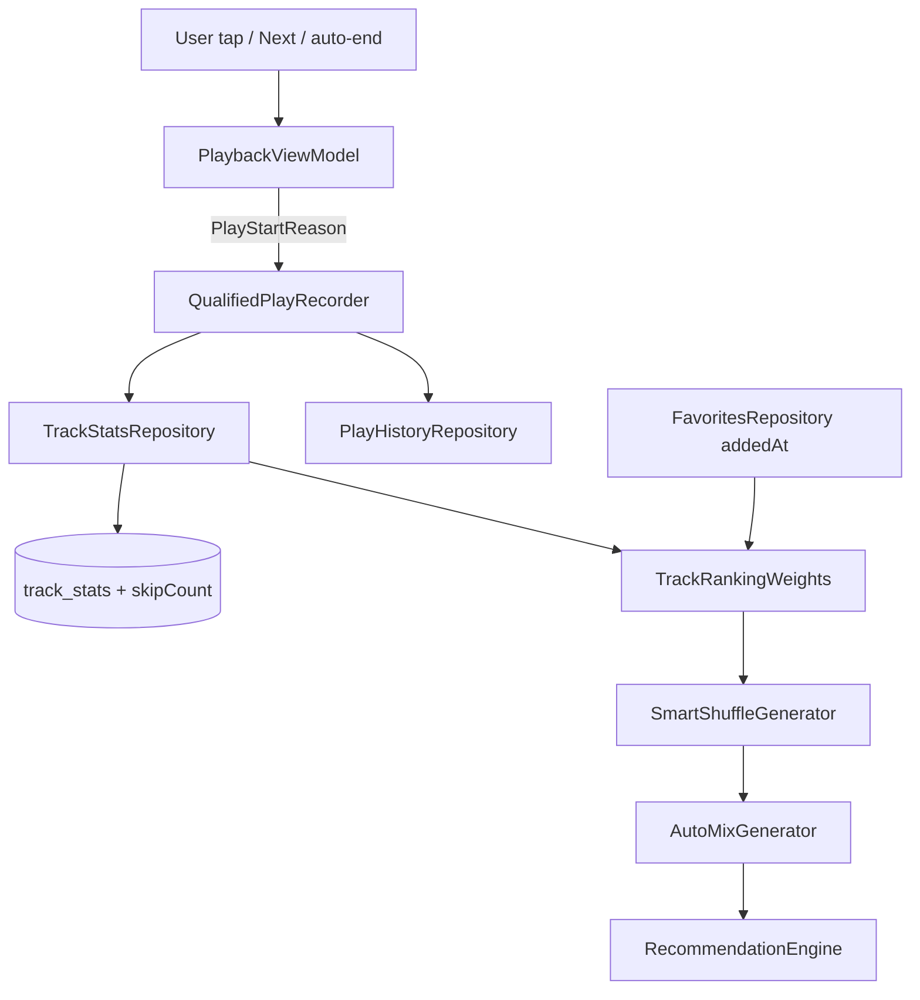

### User story

As a user, I want smart shuffle and mixes to reflect **intentional listening**, not accidental starts or immediate skips, so playback does not loop the same few tracks.

### Description

Stories **05–07** ship play counts, smart shuffle, auto-mixes, and For You rows — but weighting is largely raw play count + favorite boolean. This story tightens the **ranking signal model** per `features_to_refine.md`: qualified plays only, skip penalty, favorite recency decay. Updates **existing** `SmartShuffleGenerator`, mix builders, and recommendation weighting — no new discovery surfaces.

**Prerequisite:** stories 05 (smart shuffle), 06 (history threshold), 07 (For You / mixes).

### Goals & scope (2–3 days)

- **In scope**
  - **Qualified play**: Bump play count / `lastPlayedAt` only on explicit user start **or** existing history threshold (30 s / % listened) — not on bare auto-advance alone.
  - **Immediate skip penalty**: Skip within **15 s** → record negative signal (`skipCount` or weight decay); no play-count increment.
  - **Favorite recency**: Persist `favoritedAt`; weight recent likes above stale favorites in shuffle/mix sampling.
  - **Wire-up**: Replace raw-count weighting in existing smart shuffle and mix generators.
  - **Migration**: Room fields `favoritedAt`, optional `skipCount`.
- **Out of scope**
  - New For You rows or UI (story 07 shipped).
  - ML, thumbs-down, visible per-track scores.
  - Changing history screen layout (story 06).

### Acceptance criteria

- **AC1**: Play + skip within 15 s → no play-count increase; skip signal stored.
- **AC2**: Threshold listen still counts (aligned with story 06 history rule).
- **AC3**: Explicit tap-to-play counts immediately.
- **AC4**: Monte Carlo shuffle test: no single track > 30% of 20 picks in fixture library.
- **AC5**: Recently favorited track outranks equally played old favorite.
- **AC6**: Existing favorites backfill `favoritedAt` on migration.

### Functional requirements

- **FR1**: `PlaybackViewModel` tags explicit vs auto-advance for stats writes.
- **FR2**: Central `effectiveWeight(trackId)` used by existing shuffle/mix code paths.
- **FR3**: `FavoritesRepository.toggleFavorite` sets/clears `favoritedAt`.
- **FR4**: Constants (`SKIP_WINDOW_MS`, threshold, favorite half-life) in one config object.

### Non-functional requirements

- **NFR1**: O(1) weight per track at shuffle time; optional precompute for large libraries.
- **NFR2**: Async stats writes; no main-thread Room on skip.
- **NFR3**: Deterministic weights for unit tests.

### UX design

- **No new screens** — behavior change only.
- Favorites heart unchanged.
- Optional debug weight overlay in debug builds only.

### Testing & validation

- **Unit**: Weight function — explicit, threshold, skip, favorite decay.
- **Unit**: `SmartShuffleGenerator` distribution bounds.
- **Integration**: Fast-skip and favorite-age scenarios.
- **Regression**: History still logs at story 06 threshold; For You rows still populate.

### Out of scope

- Daily Mix theme logic (stories 15–16).
- Dislike / ban list.

---

### Overall app state after this story

Existing shuffle and mixes use **intent-aware weights** — the anti-gaming layer from `features_to_refine.md`.

### Value added after this story

Smart shuffle stops reinforcing accidental plays; recent favorites get fair exposure over years-old likes.

---

## Implementation plan

### Current gap

Playback stats are written on **every track start**, with no distinction between user intent and queue auto-advance. Shuffle weighting is a boolean favorite flag plus a top-20% play-count percentile — raw counts dominate and accidental plays compound.

```134:164:app/src/main/java/com/anplak/androidmusic/ui/PlaybackViewModel.kt
    private fun trackPlaybackStats(state: PlaybackUiState) {
        val currentTrackId = state.selectedTrack?.id
        // ...
        // Record new track play
        if (currentTrackId != null && currentTrackId != lastRecordedTrackId) {
            viewModelScope.launch {
                trackStatsRepository.recordPlay(currentTrackId)
                currentHistoryEntryId = playHistoryRepository.recordPlay(currentTrackId, currentSessionId)
                trackStartTime = System.currentTimeMillis()
            }
            lastRecordedTrackId = currentTrackId
        }
```

```65:80:app/src/main/java/com/anplak/androidmusic/player/SmartShuffleGenerator.kt
    internal fun calculateWeight(
        trackId: Long,
        favoriteIds: Set<Long>,
        highPlayCountIds: Set<Long>
    ): Double {
        var weight = DEFAULT_WEIGHT
        if (trackId in favoriteIds) weight *= FAVORITE_WEIGHT
        if (trackId in highPlayCountIds) weight *= HIGH_PLAY_COUNT_WEIGHT
        return weight
    }
```

`FavoriteEntity` already has `addedAt` (usable as `favoritedAt`); `track_stats` has no `skipCount`. `AutoMixGenerator` and `RecommendationEngine` inherit weighting only through `SmartShuffleGenerator` — no separate mix-specific ranking layer.

### Architecture overview



**Signal flow:** tag how a track started → on track end/change, classify as qualified play, fast skip, or no-op → persist → `effectiveWeight()` consumed at shuffle time (O(1) per track).

---

### Step 1 — Central config (`RankingConfig`)

Single object for all tunables (FR4). Injectable `Clock` in tests for deterministic decay.

```kotlin
// app/src/main/java/com/anplak/androidmusic/data/RankingConfig.kt
object RankingConfig {
    const val SKIP_WINDOW_MS = 15_000L
    const val QUALIFIED_PLAY_MS = 30_000L
    const val QUALIFIED_PLAY_FRACTION = 0.50f
    const val FAVORITE_BASE_MULTIPLIER = 3.0
    const val FAVORITE_HALF_LIFE_MS = 90L * 24 * 60 * 60 * 1000
    const val SKIP_DECAY_FACTOR = 0.65          // weight *= factor^skipCount
    const val PLAY_COUNT_LOG_SCALE = 1.0        // ln(1 + playCount) term
    const val MIN_WEIGHT = 0.05
    const val MAX_SHUFFLE_SHARE = 0.30          // AC4 Monte Carlo bound
}
```

**Rationale:** One config object avoids drift between playback qualification and shuffle weighting. Log-scaled play count prevents a single hyper-played track from dominating (supports AC4). Half-life favorite decay is cheap at shuffle time (one `exp` per favorite).

---

### Step 2 — Schema migration (v5 → v6)

Add `skipCount` to `track_stats`. **Do not add a new favorites column** — expose `FavoriteEntity.addedAt` as `favoritedAt` in the domain layer (already populated on insert; satisfies AC6 backfill for existing rows).

```kotlin
// AppDatabase.kt — MIGRATION_5_6
db.execSQL(
    "ALTER TABLE track_stats ADD COLUMN skipCount INTEGER NOT NULL DEFAULT 0"
)
```

```kotlin
// Entities.kt
data class TrackStatsEntity(
    @PrimaryKey val trackId: Long,
    val playCount: Int = 0,
    val lastPlayedAt: Long? = null,
    val completionCount: Int = 0,
    val skipCount: Int = 0
)
```

```kotlin
// TrackStatsDao.kt
@Query("UPDATE track_stats SET skipCount = skipCount + 1 WHERE trackId = :trackId")
suspend fun incrementSkipCount(trackId: Long)
```

**Rationale:** `skipCount` is the simplest negative signal — auditable, monotonic, works with multiplicative decay. Reusing `addedAt` avoids a redundant migration and keeps favorite ordering queries unchanged.

---

### Step 3 — Domain models & `TrackRankingWeights` (FR2)

Pure function module — no Room, fully unit-testable (NFR3).

```kotlin
// app/src/main/java/com/anplak/androidmusic/data/TrackRankingWeights.kt
data class RankingInputs(
    val playCount: Int,
    val skipCount: Int,
    val isFavorite: Boolean,
    val favoritedAt: Long?,
    val nowMs: Long
)

object TrackRankingWeights {
    fun effectiveWeight(inputs: RankingInputs): Double {
        var w = 1.0 + RankingConfig.PLAY_COUNT_LOG_SCALE * ln(1 + inputs.playCount)
        w *= RankingConfig.SKIP_DECAY_FACTOR.pow(inputs.skipCount.toDouble())
        if (inputs.isFavorite) {
            val age = (inputs.nowMs - (inputs.favoritedAt ?: inputs.nowMs)).coerceAtLeast(0)
            val decay = 0.5.pow(age.toDouble() / RankingConfig.FAVORITE_HALF_LIFE_MS)
            w *= RankingConfig.FAVORITE_BASE_MULTIPLIER * decay.coerceAtLeast(0.2)
        }
        return w.coerceAtLeast(RankingConfig.MIN_WEIGHT)
    }

    fun isQualifiedListen(listenedMs: Long, trackDurationMs: Long): Boolean =
        listenedMs >= RankingConfig.QUALIFIED_PLAY_MS ||
            (trackDurationMs > 0 &&
                listenedMs >= (trackDurationMs * RankingConfig.QUALIFIED_PLAY_FRACTION).toLong())
}
```

**Rationale:** Central `effectiveWeight` replaces ad-hoc multipliers in `SmartShuffleGenerator`. Qualification logic is shared between stats writes and history finalization (story 06 alignment). Favorite decay uses half-life so a track favorited yesterday outranks one favorited years ago at equal play count (AC5).

---

### Step 4 — Repository API changes

```kotlin
// TrackStatsRepository
suspend fun recordQualifiedPlay(trackId: Long, timestamp: Long = System.currentTimeMillis())
suspend fun recordSkip(trackId: Long)

// FavoritesRepository — add timestamp lookup for shuffle
fun getFavoriteTimestamps(): Flow<Map<Long, Long>>  // trackId → addedAt
```

`recordQualifiedPlay` = existing `insertIfNotExists` + `incrementPlayCount`. Deprecate blind `recordPlay` calls from playback path. `toggleFavorite` already sets `addedAt` on insert; `removeFavorite` clears it (FR3).

---

### Step 5 — Playback intent tagging & qualified recorder (FR1)

Introduce `PlayStartReason` and a small session state machine in `PlaybackViewModel`.

```kotlin
enum class PlayStartReason { EXPLICIT, AUTO_ADVANCE }

private data class PlaybackSession(
    val trackId: Long,
    val startedAtMs: Long,
    val startReason: PlayStartReason,
    var qualifiedPlayRecorded: Boolean = false,
    var historyEntryId: Long? = null
)

private var session: PlaybackSession? = null
private var pendingStartReason = PlayStartReason.AUTO_ADVANCE

fun onTrackSelected(tracks: List<TrackInfo>, selectedIndex: Int) {
    pendingStartReason = PlayStartReason.EXPLICIT
    queue = PlaybackQueue.fromLibrary(tracks, selectedIndex)
    audioPlayer.setQueue(tracks, selectedIndex)
}

fun onNext() {
    pendingStartReason = PlayStartReason.AUTO_ADVANCE
    audioPlayer.next()
}
```

Replace `trackPlaybackStats` tail with:

```kotlin
private fun onTrackChanged(newTrackId: Long?, position: Long, duration: Long) {
    session?.let { finalizeSession(it, position, duration) }

    if (newTrackId == null) return
    session = PlaybackSession(
        trackId = newTrackId,
        startedAtMs = System.currentTimeMillis(),
        startReason = pendingStartReason
    )
    pendingStartReason = PlayStartReason.AUTO_ADVANCE

    if (session!!.startReason == PlayStartReason.EXPLICIT) {
        viewModelScope.launch { recordQualifiedPlayFor(session!!) }  // AC3
    }
}

private suspend fun finalizeSession(s: PlaybackSession, lastPosition: Long, duration: Long) {
    val listenedMs = listenedDuration(s, lastPosition)
    when {
        s.qualifiedPlayRecorded -> { /* already counted */ }
        TrackRankingWeights.isQualifiedListen(listenedMs, duration) ->
            recordQualifiedPlayFor(s)  // AC2
        listenedMs < RankingConfig.SKIP_WINDOW_MS ->
            trackStatsRepository.recordSkip(s.trackId)  // AC1 — no play increment
        // else: auto-advance abandoned before threshold — no-op
    }
    finalizeHistoryIfQualified(s, listenedMs, duration)
}
```

**Rationale:** Explicit plays count immediately (user intent). Auto-advance waits for the same threshold as history (story 06) before incrementing play count — accidental queue churn stops inflating stats. Fast skip is detected on finalize, not on a timer, so no background job or main-thread Room work (NFR2). History entry: create a **pending** row on track start (keep timeline UX responsive), **delete** row in `finalizeSession` if not qualified — or defer insert until qualified; prefer defer to avoid orphan rows.

---

### Step 6 — Wire `SmartShuffleGenerator` to `effectiveWeight`

Replace `calculateWeight` / percentile logic with a pre-built inputs map (NFR1: one pass over stats + favorites per shuffle).

```kotlin
class SmartShuffleGenerator(
    private val favoritesRepository: FavoritesRepository,
    private val statsRepository: TrackStatsRepository,
    private val clock: RankingClock = SystemRankingClock,
    private val random: Random = Random.Default
) {
    suspend fun generateShuffledQueue(...): List<TrackInfo> {
        val statsById = statsRepository.getAllStatsOrderedByPlayCount()
            .associateBy { it.trackId }
        val favoriteTimes = favoritesRepository.getFavoriteTimestamps().first()
        val now = clock.nowMs()

        val weightedTracks = tracks.map { track ->
            val stats = statsById[track.id]
            val weight = TrackRankingWeights.effectiveWeight(
                RankingInputs(
                    playCount = stats?.playCount ?: 0,
                    skipCount = stats?.skipCount ?: 0,
                    isFavorite = track.id in favoriteTimes,
                    favoritedAt = favoriteTimes[track.id],
                    nowMs = now
                )
            )
            WeightedTrack(track, weight)
        }
        return weightedShuffle(weightedTracks, recentlyPlayedIds)
    }
}
```

`AutoMixGenerator` unchanged — it delegates to `SmartShuffleGenerator`. `RecommendationEngine` benefits automatically.

**Rationale:** Removing the top-20% percentile avoids double-boosting high play counts (log term already rewards repeats with diminishing returns). Skip penalty and favorite decay apply uniformly to library shuffle, playlist shuffle, auto-mix, and For You quick mixes.

---

### Step 7 — Optional debug overlay

Debug builds only: show `effectiveWeight` on long-press in Now Playing or a `BuildConfig.DEBUG` composable. Not required for ACs; skip if timeboxed.

---

### Key decisions

| Decision | Rationale |
|----------|-----------|
| Reuse `favorites.addedAt` as `favoritedAt` | Column already exists with per-row timestamp; AC6 backfill is free. |
| `skipCount` column vs ephemeral decay | Persisted skips survive app restarts; multiplicative decay is O(1) at read time. |
| Qualify auto-advance only at finalize | Matches story 06 history rule; no play inflation from queue auto-start. |
| Explicit play records immediately | AC3 — tap-to-play is unambiguous intent. |
| Log-scaled play count, not raw / percentile | Smoother distribution; easier to test AC4 bound; removes percentile pass. |
| Defer history insert until qualified | Keeps history timeline aligned with stats; avoids filtering in UI. |
| Pure `TrackRankingWeights` object | Deterministic unit tests (NFR3); shuffle and playback share one formula. |

---

### Migration checklist

- [ ] `RankingConfig.kt`
- [ ] `TrackRankingWeights.kt` + `RankingInputs`
- [ ] `TrackStatsEntity.skipCount`, DAO `incrementSkipCount`, migration 5→6
- [ ] `TrackStats` domain model + `recordQualifiedPlay` / `recordSkip`
- [ ] `FavoritesRepository.getFavoriteTimestamps()`
- [ ] `PlaybackViewModel` — `PlayStartReason`, session finalize, qualified history
- [ ] `SmartShuffleGenerator` — `effectiveWeight` integration; remove percentile helpers
- [ ] Update fakes in `SmartShuffleGeneratorTest`, `RecommendationEngineTest`
- [ ] Optional debug weight overlay

---

### Test scenarios

**Unit — `TrackRankingWeights`**
- Explicit qualification: 0 ms listen + `EXPLICIT` path records play (via recorder); weight uses incremented count.
- Threshold: 29 s listen → not qualified; 30 s → qualified (AC2).
- Fraction rule: 3 min track, 50% listened → qualified even if &lt; 30 s.
- Fast skip: 10 s then track change → `skipCount` +1, `playCount` unchanged (AC1).
- Favorite decay: same `playCount`, `favoritedAt` yesterday vs 2 years ago → yesterday higher weight (AC5).
- Skip penalty: two skips drive weight below never-skipped peer.

**Unit — `SmartShuffleGenerator`**
- Monte Carlo: fixture library, 20 picks × N runs; no track &gt; 30% first-pick share (AC4).
- All tracks appear exactly once per shuffle (regression).
- Recently played still pushed to queue tail (regression).

**Unit — `PlaybackViewModel` (session logic extracted if needed)**
- `onTrackSelected` → immediate qualified play write.
- `onNext` within 15 s → skip signal only.
- Auto-end after 90% duration → completion recorded; play already qualified via threshold.

**Integration**
- Play → skip fast → verify DB `skipCount` and history row absent/deleted.
- Play 35 s → verify `playCount` + history entry present.
- Toggle favorite → shuffle weight changes without play-count change.

**Regression**
- For You rows still populate (`RecommendationEngineTest` + E2E smoke).
- History screen shows only qualified listens.
- Smart shuffle / auto-mix / playlist shuffle still return full track sets.
