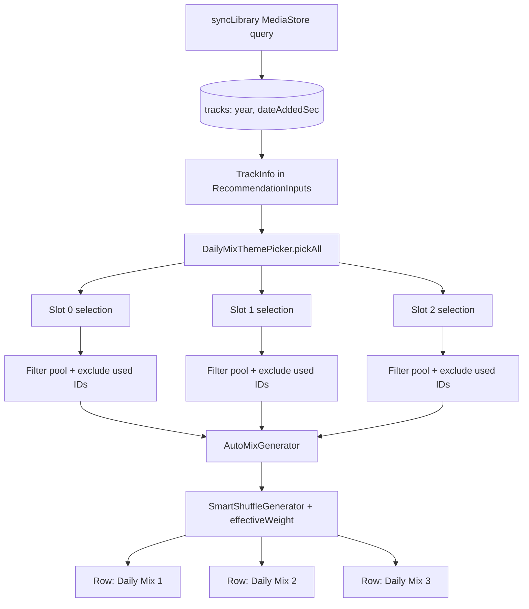

### User story

As a user, I want **multiple Daily Mixes** that change theme each day (decade, recently added, top artist, etc.) so For You stays fresh without repeating the same angle or artist seed every day.

### Description

Story **07** ships a single Daily Mix row (top-artist seed, stable per calendar day). This story **extends** `RecommendationEngine` / Daily Mix builder to emit **at least three** Daily Mix rows per day, rotating among **decade**, **date-added**, and **top-artist** themes when the library has enough metadata — with fallback to artist-seeded mixes when metadata is sparse. Reuses the existing For You row shell (one card per mix); no new navigation or detail screens.

**Prerequisite:** stories 07 (For You + Daily Mix row); story **14** (weight function) recommended.

### Goals & scope (3–4 days)

- **In scope**
  - **Multiple Daily Mix slots**: **3** rows by default (`DailyMixConfig.SLOT_COUNT`); single constant to raise later without API churn.
  - **Theme picker**: Deterministic from `LocalDate` + slot index + eligible themes (min 10 tracks per theme).
  - **Distinct angles per slot**: Prefer different theme (or decade / artist seed) across slots on the same day; dedupe tracks across slots when possible.
  - **Decade theme**: Tracks grouped by year → decade bucket; subtitle e.g. “80s gems”.
  - **Recently added theme**: Tracks by `DATE_ADDED` / first-indexed timestamp; subtitle e.g. “Added this month”.
  - **Fallback**: Top-artist Daily Mix when metadata insufficient; multiple slots use different artist seeds.
  - **Persistence**: Read `year` and `dateAdded` from MediaStore into Room during existing `syncLibrary()` — additive columns only.
- **Out of scope**
  - New For You tab or detail UI beyond extra row cards (story 07 shell).
  - Genre / language / playlist dimensions (story 16).
  - User theme preference or per-slot pinning.
  - Index policy (story 10).

### Acceptance criteria

- **AC1**: Same calendar day → identical set of Daily Mix rows (ids, themes, track sets) across refreshes.
- **AC2**: Next day → theme, seed, or track set may change per slot.
- **AC3**: Decade theme uses only tracks in the selected decade when bucket ≥ 10.
- **AC4**: Recently-added theme uses date-added, not play count.
- **AC5**: Sparse metadata → artist-seeded fallback mixes; no empty rows when library has enough tracks for at least one mix.
- **AC6**: Rich library → **3** non-empty Daily Mix rows with distinct subtitles when eligible themes allow.
- **AC7**: A track appears in at most one Daily Mix per day when alternative pool tracks exist (soft dedup — slot may repeat a track only if pool &lt; limit after exclusions).

### Functional requirements

- **FR1**: Add `year`, `dateAddedSec` to track entity / `TrackInfo` during sync (extend projection, no new scan).
- **FR2**: `DailyMixTheme` enum + slot-aware picker in existing recommendation engine.
- **FR3**: Track pick uses story 14 `effectiveWeight` when available.
- **FR4**: Each row title is **“Daily Mix N”** (N = 1…`SLOT_COUNT`); subtitle reflects that slot’s active theme.
- **FR5**: `buildDailyMixes()` returns up to `SLOT_COUNT` rows; `buildRows` appends all; row id `daily_mix_{slot}_{epochDay}`.

### Non-functional requirements

- **NFR1**: Generation **< 300 ms** for 5,000 tracks on IO thread (all slots, single pass).
- **NFR2**: Deterministic for fixed date + slot index in tests.
- **NFR3**: No extra MediaStore pass beyond existing sync.
- **NFR4**: `SLOT_COUNT` is the only knob needed to add a 4th/5th mix later.

### UX design

- **Same card** as story 07, repeated for each slot; title **“Daily Mix 1”**, **“Daily Mix 2”**, **“Daily Mix 3”**; **dynamic subtitle** per slot.
- Optional small theme icon on subtitle line.
- Fewer than 3 rows only when library cannot satisfy min pool after dedup (never show empty cards).
- Empty library: existing For You empty state.

### Testing & validation

- **Unit**: Theme picker per slot, decade parser, same-day stability, midnight rollover, cross-slot dedup, slot-count expansion.
- **Integration**: For You refresh shows 3 Daily Mix rows with fixture library containing years and added dates.
- **Regression**: Single-slot fallback behavior when only one theme eligible.

### Out of scope

- Quick Mix / Because-you-listen rows (story 07).
- User theme preference.

---

### Overall app state after this story

For You shows **three rotating Daily Mixes** covering time and library-age angles on top of the experience already shipped.

### Value added after this story

Delivers “new Daily Mix every day” across multiple slots and decade / date-added grouping from `features_to_refine.md` without rebuilding discovery UI.

---

## Implementation plan

### Current gap

Daily Mix is a **single artist-seeded row**: `buildDailyMix` picks one top artist (or random by day seed) and calls `AutoMixGenerator.fromFavoriteArtist`. The subtitle is the artist name. `TrackEntity` / `TrackInfo` carry no release year or MediaStore date-added. `buildRows` appends one `DAILY_MIX` row — no slot model, no cross-row dedup.

```43:64:app/src/main/java/com/anplak/androidmusic/data/RecommendationEngine.kt
    private suspend fun buildDailyMix(inputs: RecommendationInputs): RecommendationRow {
        val daySeed = clock.epochDay()
        val artist = inputs.topArtists30d.firstOrNull { it.isNotBlank() }
            ?: inputs.library
                .filter { it.artist.isNotBlank() }
                .randomOrNull(Random(daySeed))
                ?.artist
            ?: "Unknown Artist"

        val tracks = autoMixGenerator.fromFavoriteArtist(
            artist = artist,
            libraryTracks = inputs.library,
            limit = DAILY_MIX_LIMIT
        )

        return RecommendationRow(
            id = "daily_mix_$daySeed",
            type = RecommendationRowType.DAILY_MIX,
            title = "Daily Mix",
            subtitle = artist,
            tracks = tracks
        )
    }
```

```122:131:app/src/main/java/com/anplak/androidmusic/data/MusicLibraryRepository.kt
        val projection = arrayOf(
            MediaStore.Audio.Media._ID,
            MediaStore.Audio.Media.TITLE,
            MediaStore.Audio.Media.ARTIST,
            MediaStore.Audio.Media.ALBUM,
            MediaStore.Audio.Media.DURATION,
            MediaStore.Audio.Media.DATA,
            MediaStore.Audio.Media.DISPLAY_NAME,
            MediaStore.Audio.Media.RELATIVE_PATH
        )
```

Story **14** already wires `effectiveWeight` through `SmartShuffleGenerator` → `AutoMixGenerator`; themed mixes only need a **filtered pool** + existing shuffle path.

### Architecture overview



**Signal flow:** sync adds metadata → picker assigns **one theme/seed per slot** deterministically from `epochDay + slotIndex` → each slot filters its pool and excludes tracks already used in prior slots → weighted shuffle → up to `SLOT_COUNT` rows appended to For You.

---

### Step 1 — Schema & domain fields (FR1)

Add nullable columns to `tracks`; bump DB **v6 → v7**. Extend `TrackInfo` with defaults so existing call sites compile.

```kotlin
// Entities.kt
data class TrackEntity(
    @PrimaryKey val id: Long,
    // ... existing fields ...
    val year: Int? = null,
    val dateAddedSec: Long? = null   // MediaStore DATE_ADDED (seconds)
)

// TrackInfo.kt
data class TrackInfo(
    // ... existing fields ...
    val year: Int? = null,
    val dateAddedSec: Long? = null
)
```

```kotlin
// AppDatabase.kt — MIGRATION_6_7
db.execSQL("ALTER TABLE tracks ADD COLUMN year INTEGER")
db.execSQL("ALTER TABLE tracks ADD COLUMN dateAddedSec INTEGER")
```

Update `toTrackInfo()` / `toEntity()` in `FavoritesRepository.kt` (or a shared mapper) to pass through both fields. Apply legacy fallback in the mapper:

```kotlin
fun TrackEntity.toTrackInfo(): TrackInfo = TrackInfo(
    // ... existing fields ...
    year = year,
    dateAddedSec = dateAddedSec ?: (firstSeenAt / 1000).takeIf { firstSeenAt > 0 }
)
```

**Rationale:** Nullable columns keep migration safe for existing rows. `dateAddedSec` stores MediaStore’s native unit (seconds); convert to ms only at comparison time. `firstSeenAt` remains the app-discovery timestamp and is **not** written during sync — only a runtime fallback in `toTrackInfo()` when `dateAddedSec` is null (pre-migration rows).

---

### Step 2 — Extend `syncLibrary()` projection (FR1, NFR3)

Add `YEAR` and `DATE_ADDED` to the existing MediaStore cursor — no second scan.

```kotlin
// MusicLibraryRepository.kt — projection + cursor read
MediaStore.Audio.Media.YEAR,
MediaStore.Audio.Media.DATE_ADDED,

val year = cursor.getInt(yearColumn).takeIf { it > 0 }
val dateAddedSec = cursor.getLong(dateAddedColumn).takeIf { it > 0 }

val track = TrackInfo(..., year = year, dateAddedSec = dateAddedSec)
entities.add(track.toEntity(filePath))  // upsert fills new columns on re-sync
```

**Rationale:** MediaStore already exposes both fields on the same audio query. `@Upsert` on `insertAll` backfills metadata for cached tracks on the next sync without touching favorites or stats.

---

### Step 3 — `DailyMixTheme` enum & config (FR2, FR5, NFR4)

```kotlin
// app/src/main/java/com/anplak/androidmusic/data/DailyMixTheme.kt
enum class DailyMixTheme {
    DECADE,
    RECENTLY_ADDED,
    TOP_ARTIST   // story-07 fallback; always eligible when library non-empty
}

object DailyMixConfig {
    const val SLOT_COUNT = 3              // raise to 4+ later without other API changes
    const val MIN_TRACKS_PER_THEME = 10
    const val DAILY_MIX_LIMIT = 15
    fun monthStartEpochDay(today: Long): Long =
        java.time.LocalDate.ofEpochDay(today).withDayOfMonth(1).toEpochDay()
    fun slotSeed(epochDay: Long, slot: Int): Long = epochDay * 31L + slot
}
```

**Rationale:** `SLOT_COUNT` is the single expansion knob (NFR4). `slotSeed` combines date and slot index for stable per-slot hashes (NFR2). `TOP_ARTIST` stays in the enum so every slot can always produce a mix (AC5).

---

### Step 4 — `DailyMixThemePicker` (FR2, NFR2)

Pure, deterministic module — no Room, injectable `RecommendationClock`. Picker returns **one selection per slot**, preferring distinct themes/decades/artists within the day.

```kotlin
data class DailyMixSelection(
    val slot: Int,                       // 0-based
    val theme: DailyMixTheme,
    val decadeStart: Int? = null,
    val recentSinceEpochDay: Long? = null,
    val artistSeed: String? = null       // TOP_ARTIST only
)

object DailyMixThemePicker {
    fun pickAll(
        library: List<TrackInfo>,
        epochDay: Long,
        topArtists: List<String> = emptyList(),
        slotCount: Int = DailyMixConfig.SLOT_COUNT
    ): List<DailyMixSelection> {
        val eligibleThemes = buildEligibleThemes(library, epochDay)
        val usedThemes = mutableSetOf<DailyMixTheme>()
        val usedDecades = mutableSetOf<Int>()
        val usedArtists = mutableSetOf<String>()

        return (0 until slotCount).mapNotNull { slot ->
            val seed = DailyMixConfig.slotSeed(epochDay, slot)
            pickForSlot(
                library, seed, slot, eligibleThemes,
                topArtists, usedThemes, usedDecades, usedArtists
            )
        }
    }

    private fun pickForSlot(
        library: List<TrackInfo>,
        seed: Long,
        slot: Int,
        eligibleThemes: List<DailyMixTheme>,
        topArtists: List<String>,
        usedThemes: MutableSet<DailyMixTheme>,
        usedDecades: MutableSet<Int>,
        usedArtists: MutableSet<String>
    ): DailyMixSelection {
        // Prefer unused theme; fall back to full eligible list
        val themePool = eligibleThemes.filter { it !in usedThemes }
            .ifEmpty { eligibleThemes }
        val theme = themePool[(seed % themePool.size).toInt()]
        usedThemes += theme

        return when (theme) {
            DailyMixTheme.DECADE -> {
                val decades = eligibleDecades(library).filter { it !in usedDecades }
                    .ifEmpty { eligibleDecades(library) }
                val decade = decades[(seed / themePool.size % decades.size.coerceAtLeast(1)).toInt()]
                usedDecades += decade
                DailyMixSelection(slot, theme, decadeStart = decade)
            }
            DailyMixTheme.RECENTLY_ADDED ->
                DailyMixSelection(slot, theme, recentSinceEpochDay = DailyMixConfig.monthStartEpochDay(seed))
            DailyMixTheme.TOP_ARTIST -> {
                val artist = resolveArtistSeed(seed, slot, topArtists, library, usedArtists)
                usedArtists += artist
                DailyMixSelection(slot, theme, artistSeed = artist)
            }
        }
    }

    fun poolFor(selection: DailyMixSelection, library: List<TrackInfo>, epochDay: Long): List<TrackInfo> =
        when (selection.theme) {
            DailyMixTheme.DECADE -> library.filter {
                it.year?.let { y -> (y / 10) * 10 == selection.decadeStart } == true
            }
            DailyMixTheme.RECENTLY_ADDED -> recentPool(library, epochDay)
            DailyMixTheme.TOP_ARTIST -> library.filter {
                it.artist.equals(selection.artistSeed, ignoreCase = true)
            }.ifEmpty { library }
        }

    // eligibleDecades, recentPool, resolveArtistSeed — same helpers as before
}
```

**Rationale:** Slot index in the seed guarantees slot 0 ≠ slot 1 on the same day even when only one theme is eligible (AC1, AC2). `usedThemes` / `usedDecades` / `usedArtists` steer slots toward **distinct angles** (AC6). `pickAll` returns only slots the picker can describe; empty mixes are dropped later in `buildDailyMixes`.

---

### Step 5 — Subtitle & title helpers (FR4)

```kotlin
fun DailyMixSelection.rowTitle(): String = "Daily Mix ${slot + 1}"

fun DailyMixSelection.subtitle(): String = when (theme) {
    DailyMixTheme.DECADE -> "${(decadeStart!! % 100)}s gems"
    DailyMixTheme.RECENTLY_ADDED -> "Added this month"
    DailyMixTheme.TOP_ARTIST -> artistSeed.orEmpty()
}
```

Optional UX: map theme → `Icons.Outlined` drawable on the subtitle line in `ForYouScreen` (no layout changes — existing `RecommendationRowSection` already renders N rows).

**Rationale:** Numbered titles distinguish slots in the For You list (FR4). Subtitle carries theme context per slot.

---

### Step 6 — `buildDailyMixes` with cross-slot dedup (FR3, FR5)

Replace `buildDailyMix` with a plural builder; wire in `buildRows`:

```kotlin
// RecommendationEngine.buildRows
rows += buildDailyMixes(inputs)

private suspend fun buildDailyMixes(inputs: RecommendationInputs): List<RecommendationRow> {
    val daySeed = clock.epochDay()
    val selections = DailyMixThemePicker.pickAll(
        library = inputs.library,
        epochDay = daySeed,
        topArtists = inputs.topArtists30d
    )
    val usedTrackIds = mutableSetOf<Long>()
    val rows = mutableListOf<RecommendationRow>()

    for (selection in selections) {
        val pool = DailyMixThemePicker.poolFor(selection, inputs.library, daySeed)
            .filter { it.id !in usedTrackIds }
        if (pool.size < DailyMixConfig.MIN_TRACKS_PER_THEME) continue

        val tracks = when (selection.theme) {
            DailyMixTheme.TOP_ARTIST ->
                autoMixGenerator.fromFavoriteArtist(
                    artist = selection.artistSeed!!,
                    libraryTracks = pool,
                    limit = DAILY_MIX_LIMIT
                )
            else ->
                autoMixGenerator.fromSmartPlaylist(pool, DAILY_MIX_LIMIT)
        }
        if (tracks.isEmpty()) continue

        usedTrackIds += tracks.map { it.id }
        rows += RecommendationRow(
            id = "daily_mix_${selection.slot}_$daySeed",
            type = RecommendationRowType.DAILY_MIX,
            title = selection.rowTitle(),
            subtitle = selection.subtitle(),
            tracks = tracks
        )
    }
    return rows
}
```

`fromSmartPlaylist` / `fromFavoriteArtist` delegate to `SmartShuffleGenerator`, so **FR3** (effectiveWeight) needs no new weighting code.

**Rationale:** Sequential build with `usedTrackIds` implements soft cross-slot dedup (AC7). Slots with insufficient pool after exclusion are skipped — avoids thin or duplicate rows. `TOP_ARTIST` uses a **narrowed pool** (same artist, minus used tracks) so artist mixes stay on-theme while deduping. Row id includes slot index for stable keys across refreshes (AC1).

---

### Step 7 — Performance guard (NFR1)

Precompute **once per `buildDailyMixes` call**: eligible themes, decade counts, recent pool (O(n)). Reuse across all slots. Cross-slot dedup is O(slots × limit) with `slots = 3` today.

Target: &lt; 300 ms for 5,000 tracks × 3 slots on `Dispatchers.IO`. If profiling fails, cache `pickAll` + pool results keyed by `(epochDay, libraryVersion)` in the For You ViewModel layer.

---

### Key decisions

| Decision | Rationale |
|----------|-----------|
| `SLOT_COUNT = 3` constant | Ships three mixes now; bump one line to add more (NFR4). |
| `slotSeed = epochDay * 31 + slot` | Stable per-slot hash; slots differ even when theme pool is small. |
| Distinct theme/decade/artist preference per slot | AC6 — three mixes feel like three angles, not one mix repeated. |
| Soft cross-slot track dedup | AC7 — variety across rows; allow overlap only when pool exhausted. |
| Skip slot when pool &lt; MIN after dedup | Never emit empty or near-empty cards. |
| Title `Daily Mix N`, id `daily_mix_{slot}_{day}` | FR4/FR5; For You list differentiates slots without new UI components. |
| `dateAddedSec` from MediaStore, not `firstSeenAt` in sync | AC4 — recently-added theme reflects MediaStore indexing time. |
| `firstSeenAt` fallback in `toTrackInfo()` only | Pre-migration rows still participate. |
| `fromSmartPlaylist` for decade/recent; narrowed pool for artist | Themed pools stay pure; artist slot still dedupes against prior slots. |
| Reuse story 14 shuffle weights | No duplicate ranking logic. |

---

### Migration checklist

- [ ] `TrackEntity.year`, `TrackEntity.dateAddedSec`; `TrackInfo` fields + mapper updates
- [ ] `AppDatabase` v7 + `MIGRATION_6_7`
- [ ] `MusicLibraryRepository.syncLibrary()` — `YEAR`, `DATE_ADDED` in projection
- [ ] `DailyMixTheme.kt`, `DailyMixConfig` (`SLOT_COUNT`), `DailyMixThemePicker.pickAll`, `DailyMixSelection`
- [ ] `RecommendationEngine.buildDailyMixes` + `buildRows` wiring; remove `buildDailyMix`
- [ ] Optional: theme icon on `ForYouScreen` subtitle row
- [ ] Update `RecommendationEngineTest` — expect 3 rows, slot ids, dedup
- [ ] Unit tests for per-slot picker, dedup, `SLOT_COUNT` bump smoke test

---

### Test scenarios

**Unit — `DailyMixThemePicker`**
- Same `epochDay` + library → identical `pickAll` result (AC1).
- `epochDay + 1` → at least one slot’s theme or seed may differ (AC2).
- Three slots on rich fixture → three distinct themes or decades when eligible (AC6).
- `SLOT_COUNT = 4` in test → four selections without code changes beyond constant (NFR4).
- Decade bucket with 9 tracks → not eligible for DECADE slot.
- Recent pool uses `dateAddedSec`, not play count (AC4).

**Unit — `buildDailyMixes`**
- Rich library → 3 rows, titles “Daily Mix 1/2/3”, ids `daily_mix_{0,1,2}_$day`.
- Track sets pairwise: no overlap when library has enough alternative tracks (AC7).
- Sparse metadata → 1–3 artist mixes, all non-empty when library ≥ 10 tracks (AC5).
- Empty library → no rows.

**Integration**
- For You list shows three Daily Mix cards after sync fixture with years and dates.

**Regression**
- Quick Mix / Because-you-listen rows unchanged.
- Single-theme library still produces at least one Daily Mix row.
