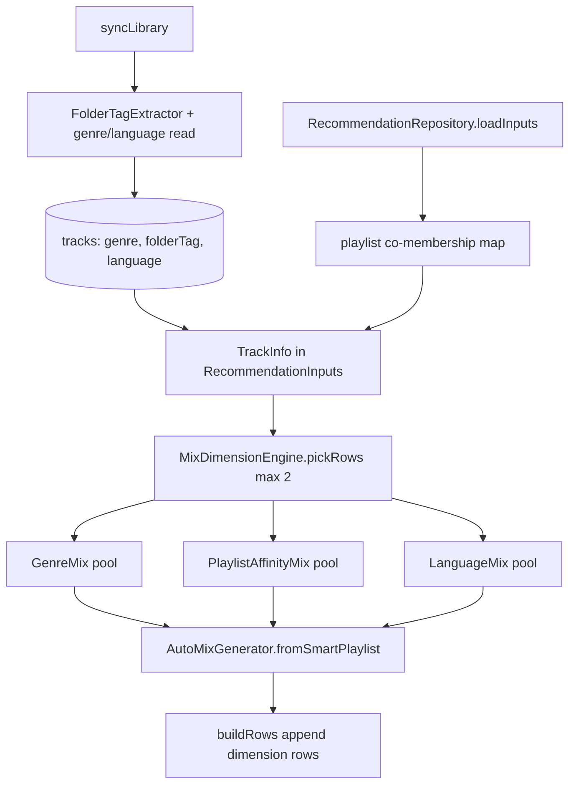

### User story

As a user, I want extra For You rows based on **genre, language, my playlists, and how I organize music on disk** so discovery reflects how my library is tagged and curated — even when file tags are sparse.

### Description

Story **07** ships For You rows (Daily Mix, Quick Mix, Because you listen, Continue Listening). Story **15** extends Daily Mix themes. This story adds up to **two new heuristic rows** to the existing `RecommendationEngine.buildRows()` — genre, language/country (best-effort), playlist co-membership — and optionally enriches **Quick Mix** with the same dimensions. No new screens or navigation.

**Folder-derived classifiers:** Many users organize music by directory rather than ID3 tags (e.g. `Music/metal/artist1/…`, `Music/rock/artist3/…`). During sync, derive **inherited path tags** from folder segments above the artist/album leaf and treat them as **user-defined metadata** — a lightweight, offline taxonomy with no editor UI in v1. These tags supplement MediaStore `GENRE` when tags are missing and can surface the same genre-style mix rows.

**Prerequisite:** stories 04 (user playlists), 07 (For You), 15 (Daily Mix themes); story **14** for weights; story **12** folder rules (paths already indexed).

### Goals & scope (2–3 days)

- **In scope**
  - **Folder path classifiers**: During `syncLibrary()`, parse each track's stored `path` / `RELATIVE_PATH` and persist one or more **folder tags** (e.g. `metal`, `rock`) inherited from parent directory names.
  - **Genre row**: “Your {genre} mix” when ≥ 8 tracks share a genre bucket from **MediaStore `GENRE` or folder tag** (folder tag used when `GENRE` absent; prefer explicit tag when both exist).
  - **Playlist affinity row**: “From your playlists” — tracks co-listed with recent favorites/plays in user playlists.
  - **Language row** (best-effort): When ≥ 8 tracks share derived language bucket from tags/heuristics.
  - **Cap**: At most 2 extra dimension rows per refresh; omit row when data insufficient.
  - **Sync additive fields**: Persist `genre`, optional `language`, and optional `folderTags` (or merged into genre resolution) in existing `syncLibrary()` projection.
- **Out of scope**
  - For You tab, card layout, detail screens, playback hooks (story 07).
  - Daily Mix theme rotation (story 15).
  - ML language detection, metadata editor, user configuration of which path depth counts as a tag.
  - Treating artist or album folder names as classifiers (v1 uses segments **above** artist/album depth only — see FR6).
  - Concert/news backend.

### Acceptance criteria

- **AC1**: Genre row appears when ≥ 8 tracks share a MediaStore `GENRE` **or** the same folder tag; contents match that bucket.
- **AC2**: Playlist row surfaces co-playlist siblings of a recent favorite/seed, excluding seed.
- **AC3**: Language row omitted when confidence/count too low — no error UI.
- **AC4**: Row tap → existing detail → Play all unchanged from story 07.
- **AC5**: All tracks indexed and playable.
- **AC6**: Total For You rows stay ≤ ~5 including existing story-07 rows.
- **AC7**: Tracks under `…/metal/artist/…` and `…/metal/other-artist/…` both inherit folder tag `metal`; row title may read “Your metal mix” when count threshold met and no conflicting `GENRE`.

### Functional requirements

- **FR1**: Extend Room track fields for `genre`, optional `language`, and folder-derived tags during existing sync.
- **FR2**: Playlist co-membership query on existing playlist tables.
- **FR3**: `MixDimensionEngine` (or engine extension) returns optional `GenreMix`, `PlaylistAffinityMix`, `LanguageMix`.
- **FR4**: Append to existing `buildRows()` after story-07 and story-15 rows; priority genre > playlist > language.
- **FR5**: Quick Mix may reuse same dimension pick for smaller track set (8–12).
- **FR6 — folder tag extraction**: From resolved file path, take segments under the indexed music root (e.g. public `Music/` or include-rule root), **excluding** generic roots (`Music`, `Download`), file names, and the last two segments when path depth allows (assumed artist + album). Remaining segments become normalized folder tags (lowercase, trimmed). Example: `Music/metal/Artist A/Album/track.mp3` → `["metal"]`; `Music/rock/Artist B/track.mp3` → `["rock"]`.
- **FR7 — genre resolution**: Effective genre for mix eligibility = non-blank MediaStore `GENRE` if present, else primary folder tag (first segment after root when only one classifier applies).
- **FR8**: Folder tags are read-only, derived on every sync; no merge with user prompts from `features_to_refine.md` in this story.

### Non-functional requirements

- **NFR1**: Co-membership query **< 100 ms** for typical playlist sizes.
- **NFR2**: Aggregate genre/language/folder tags once per refresh.
- **NFR3**: Conservative language heuristic — omit rather than mislabel.
- **NFR4**: Path parsing is O(segments) per track during sync only; no extra MediaStore pass.

### UX design

- **Identical row pattern** to story 07 horizontal sections.
- Titles: “Your rock mix”, “Your metal mix” (folder-sourced when untagged), “From your playlists”, language name when tagged.
- No placeholder rows when metadata missing.
- No UI surfacing of raw path segments — folder tags affect mix selection only.

### Testing & validation

- **Unit**: Genre aggregation (MediaStore + folder fallback), playlist overlap, language bucket eligibility, path → folder tag parser (depth, normalization, generic segment skip).
- **Integration**: Fixture DB with mixed tagged/untagged tracks under `metal/` and `rock/` paths → expected optional row IDs in `buildRows()` output.
- **Regression**: Story-07 rows unchanged when new dimensions omitted; tracks with both `GENRE` and folder tag prefer `GENRE` for row bucket.

### Out of scope

- Rebuilding RecommendationEngine from scratch.
- More than two new dimension types in v1.
- Backend or network features.
- User-editable folder taxonomy or “promote folder to genre” settings.

---

### Overall app state after this story

For You adds **metadata- and playlist-aware** rows on the existing discovery surface — including mixes driven by **how the user folders their library** — completing the auto-generated mix dimensions from `features_to_refine.md`.

### Value added after this story

Discovery respects ID3 tags, **implicit folder organization**, and user-curated playlists without any server or new UI chrome. Users who sort by `metal/` vs `rock/` get relevant mixes even when files lack genre metadata.

---

## Implementation plan

### Current gap

`RecommendationEngine.buildRows()` emits story-07/15 rows only — no metadata- or playlist-dimension rows. `TrackEntity` / `TrackInfo` carry `path`, `year`, and `dateAddedSec` but **no `genre`, `language`, or folder-derived tags**. Sync does not read MediaStore genre; playlist tables exist but nothing queries **co-playlist siblings** for discovery.

```11:22:app/src/main/java/com/anplak/androidmusic/data/RecommendationEngine.kt
    suspend fun buildRows(inputs: RecommendationInputs): List<RecommendationRow> {
        if (inputs.library.isEmpty()) return emptyList()

        val libraryById = inputs.library.associateBy { it.id }
        val rows = mutableListOf<RecommendationRow>()

        buildContinueListening(inputs, libraryById)?.let { rows += it }
        rows += buildDailyMixes(inputs)
        rows += buildBecauseRows(inputs, libraryById)
        rows += buildQuickMixes(inputs)

        return rows.distinctBy { it.id }.filter { it.tracks.isNotEmpty() }
    }
```

```122:133:app/src/main/java/com/anplak/androidmusic/data/MusicLibraryRepository.kt
        val projection = arrayOf(
            MediaStore.Audio.Media._ID,
            MediaStore.Audio.Media.TITLE,
            MediaStore.Audio.Media.ARTIST,
            MediaStore.Audio.Media.ALBUM,
            MediaStore.Audio.Media.DURATION,
            MediaStore.Audio.Media.DATA,
            MediaStore.Audio.Media.DISPLAY_NAME,
            MediaStore.Audio.Media.RELATIVE_PATH,
            MediaStore.Audio.Media.YEAR,
            MediaStore.Audio.Media.DATE_ADDED
        )
```

`RecommendationRowType` has no genre / playlist / language variants; `ForYouScreen` already renders any `RecommendationRow` via `for_you_row_${row.id}` — **no new UI components** needed.

### Architecture overview



**Signal flow:** sync enriches each track once → repository loads library + playlist overlap data → `MixDimensionEngine` picks up to **two** dimension rows by priority (genre > playlist > language) → weighted shuffle via existing `AutoMixGenerator` → append rows with stable ids.

---

### Step 1 — Schema & domain fields (FR1)

Add nullable columns; bump DB **v7 → v8**. Store a **single primary** `folderTag` (first classifier segment) — sufficient for v1 row eligibility; multi-segment paths can be expanded later.

```kotlin
// Entities.kt
data class TrackEntity(
    @PrimaryKey val id: Long,
    // ... existing fields ...
    val genre: String? = null,       // MediaStore / embedded tag when available
    val folderTag: String? = null,   // primary path classifier, normalized
    val language: String? = null     // bucket key, e.g. "en", "de"; null when unknown
)

// TrackInfo.kt
data class TrackInfo(
    // ... existing fields ...
    val genre: String? = null,
    val folderTag: String? = null,
    val language: String? = null
) {
    fun effectiveGenre(): String? =
        genre?.trim()?.takeIf { it.isNotBlank() }
            ?: folderTag?.trim()?.takeIf { it.isNotBlank() }
}
```

```kotlin
// AppDatabase.kt — MIGRATION_7_8
db.execSQL("ALTER TABLE tracks ADD COLUMN genre TEXT")
db.execSQL("ALTER TABLE tracks ADD COLUMN folderTag TEXT")
db.execSQL("ALTER TABLE tracks ADD COLUMN language TEXT")
```

Update `toTrackInfo()` / `toEntity()` in `FavoritesRepository.kt` to pass through all three fields.

**Rationale:** Separate `genre` and `folderTag` preserves FR7 (explicit tag wins at mix time) and allows re-deriving folder tags on every sync without overwriting user-visible ID3 genre. Nullable TEXT columns keep migration safe; upsert backfills on next sync.

---

### Step 2 — Extend `syncLibrary()` projection (FR1, FR6, NFR4)

Add genre to the existing MediaStore cursor. Parse folder tag from the already-resolved `filePath`. Language only when a confident source exists.

```kotlin
// MusicLibraryRepository.kt — projection (add if column present on device API)
MediaStore.Audio.Media.GENRE,   // may be blank on many files; safe to read

val genre = cursor.getString(genreColumn)?.trim()?.takeIf { it.isNotBlank() }
val folderTag = FolderTagExtractor.primaryTag(filePath)
val language = LanguageTagResolver.resolve(cursor, filePath)  // null unless confident

val track = TrackInfo(..., genre = genre, folderTag = folderTag, language = language)
entities.add(track.toEntity(filePath))
```

```kotlin
// FolderTagExtractor.kt — new pure object
object FolderTagExtractor {
    private val GENERIC_ROOTS = setOf("music", "download", "downloads", "audio", "media")

    fun primaryTag(filePath: String): String? = extractTags(filePath).firstOrNull()

    fun extractTags(filePath: String): List<String> {
        if (filePath.isBlank()) return emptyList()
        val segments = filePath.split('/', '\\')
            .map { it.trim() }
            .filter { it.isNotBlank() && !it.contains('.') }  // drop filename
        if (segments.size <= 2) return emptyList()

        // Drop assumed artist + album leaf folders when depth allows (FR6)
        val withoutLeaf = when {
            segments.size >= 4 -> segments.dropLast(2)
            segments.size == 3 -> segments.dropLast(1)
            else -> segments
        }

        return withoutLeaf
            .map { it.lowercase() }
            .filter { it !in GENERIC_ROOTS }
            .distinct()
    }
}
```

**Rationale:** Path parsing runs O(segments) per track inside the existing sync loop — no second MediaStore pass (NFR4). `GENERIC_ROOTS` avoids treating `Music/` itself as a genre. Keeping extraction pure and unit-tested avoids coupling to Room or UI.

---

### Step 3 — Conservative language resolver (FR3, NFR3)

```kotlin
// LanguageTagResolver.kt
object LanguageTagResolver {
    /** Returns ISO-ish bucket only when tag/heuristic is explicit; else null. */
    fun resolve(cursor: Cursor, filePath: String): String? {
        // v1: read embedded LANGUAGE tag when MediaStore exposes it; no ML, no script guessing
        val fromStore = readMediaStoreLanguage(cursor)?.normalize()
        return fromStore?.takeIf { isKnownBucket(it) }
    }
}
```

**Rationale:** AC3 / NFR3 — omitting the language row is preferable to mislabeling. v1 can ship with `resolve()` always returning `null` if no reliable column exists on target API; the engine already skips ineligible dimensions.

---

### Step 4 — Playlist co-membership query (FR2, NFR1)

Add one indexed query on existing `playlist_tracks`; load into `RecommendationInputs` at refresh time.

```kotlin
// PlaylistDao.kt
@Query("""
    SELECT DISTINCT pt2.trackId
    FROM playlist_tracks pt1
    INNER JOIN playlist_tracks pt2 ON pt1.playlistId = pt2.playlistId
    WHERE pt1.trackId = :seedId AND pt2.trackId != :seedId
    ORDER BY pt2.addedAt DESC
    LIMIT :limit
""")
suspend fun getCoPlaylistTrackIds(seedId: Long, limit: Int): List<Long>
```

```kotlin
// RecommendationRepositoryImpl.loadInputs()
val playlistSeeds = (favorites.take(3) + topTracks.take(3)).distinct()
val coPlaylistBySeed = playlistSeeds.associateWith { seedId ->
    playlistRepository.getCoPlaylistTrackIds(seedId, CO_PLAYLIST_LIMIT)
}

return RecommendationInputs(
    // ... existing fields ...
    coPlaylistBySeed = coPlaylistBySeed
)
```

**Rationale:** Single JOIN on `playlist_tracks` stays well under 100 ms for typical playlist sizes (NFR1). Reuses the same seed selection pattern as co-play history. Repository owns I/O; engine stays pure over `RecommendationInputs`.

---

### Step 5 — `MixDimensionEngine` (FR3, FR4, FR5)

New module returning **at most two** optional dimension rows, evaluated in priority order.

```kotlin
// MixDimensionEngine.kt
object MixDimensionConfig {
    const val MIN_TRACKS_PER_BUCKET = 8
    const val MAX_DIMENSION_ROWS = 2
    const val GENRE_MIX_LIMIT = 15
    const val PLAYLIST_MIX_LIMIT = 15
    const val LANGUAGE_MIX_LIMIT = 15
    const val QUICK_MIX_DIMENSION_LIMIT = 10
}

data class DimensionMix(
    val id: String,
    val type: RecommendationRowType,
    val title: String,
    val subtitle: String?,
    val seedTrack: TrackInfo? = null,
    val pool: List<TrackInfo>
)

object MixDimensionEngine {
    fun pickCandidates(inputs: RecommendationInputs, epochDay: Long): List<DimensionMix> {
        val picks = mutableListOf<DimensionMix>()
        pickGenreMix(inputs, epochDay)?.let { picks += it }
        if (picks.size < MixDimensionConfig.MAX_DIMENSION_ROWS) {
            pickPlaylistAffinityMix(inputs, epochDay)?.let { picks += it }
        }
        if (picks.size < MixDimensionConfig.MAX_DIMENSION_ROWS) {
            pickLanguageMix(inputs, epochDay)?.let { picks += it }
        }
        return picks.take(MixDimensionConfig.MAX_DIMENSION_ROWS)
    }

    private fun pickGenreMix(inputs: RecommendationInputs, epochDay: Long): DimensionMix? {
        val buckets = inputs.library
            .mapNotNull { track -> track.effectiveGenre()?.let { it to track } }
            .groupBy({ it.first.lowercase() }, { it.second })
        val (bucket, pool) = buckets
            .filter { (_, tracks) -> tracks.size >= MixDimensionConfig.MIN_TRACKS_PER_BUCKET }
            .maxByOrNull { (_, tracks) -> tracks.size }
            ?: return null

        val label = bucket.replaceFirstChar { it.uppercase() }
        return DimensionMix(
            id = "genre_mix_${bucket}_$epochDay",
            type = RecommendationRowType.GENRE_MIX,
            title = "Your $label mix",
            subtitle = null,
            pool = pool
        )
    }
}
```

Playlist and language pickers follow the same shape: build pool → return `DimensionMix` or `null`.

**Rationale:** Isolating dimension logic keeps `RecommendationEngine` thin. Priority order matches FR4. Genre aggregation uses `effectiveGenre()` so folder-tagged untagged files and ID3-tagged files share one bucket, with ID3 winning per track (FR7). Deterministic `epochDay` in row id gives stable For You keys across refresh (same pattern as Daily Mix).

---

### Step 6 — Wire `RecommendationEngine` (FR4, FR5)

Extend enum and append dimension rows **after** existing rows.

```kotlin
// RecommendationModels.kt
enum class RecommendationRowType {
    BECAUSE_YOU_LISTEN,
    QUICK_MIX,
    DAILY_MIX,
    CONTINUE_LISTENING,
    GENRE_MIX,
    PLAYLIST_AFFINITY,
    LANGUAGE_MIX
}

data class RecommendationInputs(
    // ... existing fields ...
    val coPlaylistBySeed: Map<Long, List<Long>> = emptyMap()
)
```

```kotlin
// RecommendationEngine.buildRows
rows += buildQuickMixes(inputs)
rows += buildDimensionRows(inputs)

private suspend fun buildDimensionRows(inputs: RecommendationInputs): List<RecommendationRow> {
    val epochDay = clock.epochDay()
    val libraryById = inputs.library.associateBy { it.id }
    return MixDimensionEngine.pickCandidates(inputs, epochDay).mapNotNull { candidate ->
        val tracks = autoMixGenerator.fromSmartPlaylist(
            candidate.pool,
            limitFor(candidate.type),
            random = Random(candidate.id.hashCode().toLong())
        )
        if (tracks.isEmpty()) return@mapNotNull null
        RecommendationRow(
            id = candidate.id,
            type = candidate.type,
            title = candidate.title,
            subtitle = candidate.subtitle,
            seedTrack = candidate.seedTrack,
            tracks = tracks
        )
    }
}
```

Optional Quick Mix enrichment (FR5): when a genre dimension is eligible, one Quick Mix slot may call `fromSmartPlaylist(genrePool, QUICK_MIX_DIMENSION_LIMIT)` instead of `fromFavoriteTrack` — gated behind a simple `if (genrePool.size >= MIN)` check in `buildQuickMixes`.

**Rationale:** Reuses `AutoMixGenerator.fromSmartPlaylist` → story-14 weights with no new ranking code. New row types reuse existing For You section, detail, and Play all flow (AC4). Dimension rows come last so core story-07/15 rows are unaffected when metadata is sparse.

---

### Step 7 — Performance guard (NFR1, NFR2)

- Aggregate genre / language buckets **once** inside `MixDimensionEngine.pickCandidates` (single O(n) pass).
- Load `coPlaylistBySeed` for at most ~6 seeds in `RecommendationRepository` — not per track.
- Target: dimension pick + shuffle **< 100 ms** on IO for 5,000 tracks; profile co-playlist query separately on device fixtures.

---

### Key decisions

| Decision | Rationale |
|----------|-----------|
| Store `folderTag` separately from `genre` | FR7 — ID3 genre preserved; folder tag is fallback only at mix time via `effectiveGenre()`. |
| Single primary `folderTag` column | Covers v1 row eligibility; avoids JSON parsing in Room queries. |
| `FolderTagExtractor` as pure object | Testable without MediaStore; same rules on every sync (FR8). |
| Drop last 2 path segments as artist/album | Matches FR6 example layout; avoids polluting buckets with artist folder names. |
| `MixDimensionEngine` not inline in engine | Keeps recommendation orchestration vs dimension heuristics separate; easier to cap and prioritize. |
| Max 2 dimension rows, genre > playlist > language | FR4 + AC6 — additive discovery without flooding For You. |
| Playlist siblings via one DAO JOIN | Fast, offline, no new tables; leverages story-04 data. |
| Language row omitted unless confident | NFR3 / AC3 — no error UI, no guesswork. |
| Row ids include bucket + `epochDay` | Stable list keys; daily rotation possible without colliding with Daily Mix ids. |
| Reuse `ForYouScreen` row shell | AC4 — zero new navigation; test tags `for_you_row_${id}` work automatically. |

---

### Migration checklist

- [ ] `TrackEntity.genre`, `folderTag`, `language`; `TrackInfo` fields + `effectiveGenre()`
- [ ] `AppDatabase` v8 + `MIGRATION_7_8`
- [ ] `FolderTagExtractor.kt`, `LanguageTagResolver.kt`
- [ ] `MusicLibraryRepository.syncLibrary()` — genre read + folder tag derivation
- [ ] `PlaylistDao.getCoPlaylistTrackIds` + `PlaylistRepository` wrapper
- [ ] `RecommendationInputs.coPlaylistBySeed`; repository wiring
- [ ] `MixDimensionEngine.kt`, `MixDimensionConfig`
- [ ] `RecommendationRowType` additions; `RecommendationEngine.buildDimensionRows`
- [ ] Optional: one Quick Mix slot uses genre pool (FR5)
- [ ] `E2ETestRecommendations` helpers for dimension row queries

---

### Test scenarios

**Unit — `FolderTagExtractor`**
- `Music/metal/Artist A/Album/track.mp3` → `["metal"]`.
- `Music/rock/Artist B/track.mp3` → `["rock"]`.
- `Music/Downloads/Artist/track.mp3` → `[]` (generic root stripped).
- Mixed-case segments normalize to lowercase.

**Unit — `effectiveGenre` / genre aggregation**
- Track with `genre = "Rock"` and `folderTag = "metal"` → bucket `"Rock"`.
- Track with blank genre and `folderTag = "metal"` → bucket `"metal"`.
- 7 metal-folder tracks → no genre row; 8+ → eligible.

**Unit — `MixDimensionEngine`**
- Library with rock (ID3) and metal (folder-only) → genre row picks larger bucket.
- Genre + playlist both eligible → only genre row when cap = 1; both when cap = 2.
- Language buckets all null → language row absent (AC3).
- Row id/title: `Your metal mix` for folder-sourced bucket (AC7).

**Unit — playlist affinity**
- Seed in playlist `{A, B, C}` → pool `{B, C}` excluding seed.
- Seed in no playlist → playlist dimension omitted.

**Unit — `buildRows` integration (fixture inputs)**
- Sparse metadata library → story-07/15 rows unchanged; zero dimension rows.
- Rich metadata → at most 2 new rows appended after Quick Mix.
- Genre row tracks all match `effectiveGenre()` bucket.

**E2E — `MetadataMixE2ETest` (new, mirrors `DailyMixE2ETest` pattern)**
- `test01_forYou_showsGenreMixWhenFolderLibrary`: device library with ≥ 8 tracks under a shared folder segment (e.g. `…/metal/…`) and sparse ID3 genre → scroll to `for_you_row_genre_mix_*`, assert title contains `"mix"`.
- `test02_playlistAffinityRowWhenPlaylistsExist`: user has playlist with ≥ 3 tracks and a favorited seed → engine returns `PLAYLIST_AFFINITY` row; UI shows `for_you_row_*` with subtitle referencing seed playlist context.
- `test03_dimensionRow_seeAllAndPlayMix`: tap `for_you_see_all_{id}` → detail screen; Play all uses existing queue path (AC4).
- `test04_noLanguageRowWithoutTags`: library without language metadata → no `for_you_row_language_mix_*` (AC3).
- `test05_regression_dailyMixAndQuickMixStillRender`: dimension rows present or absent — Daily Mix / Quick Mix / Because rows still appear (`DailyMixE2ETest` parity).

**E2E helpers — extend `E2ETestRecommendations`**
- `genreMixRows(context)`, `playlistAffinityRows(context)`, `tracksWithFolderTag(context, tag)`.
- Graceful skip when on-device library too small (same pattern as `libraryMeetsDailyMixMinimum`).

**Regression**
- `RecommendationEngineTest` — existing Daily Mix / Because / Continue assertions unchanged when inputs lack genre and playlists.
- Tracks with both ID3 genre and folder tag → row bucket follows ID3, not folder parent.
