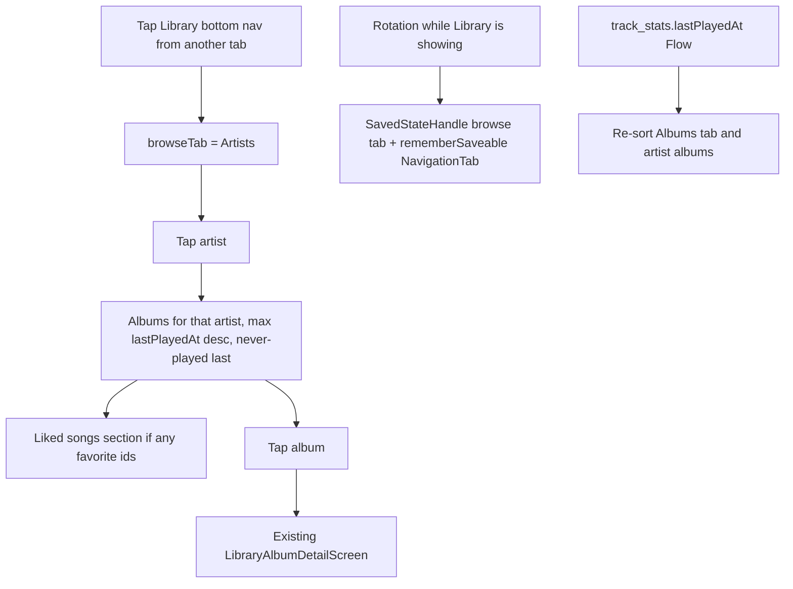

# Library opens on Artists, with albums ordered by what you played recently

## Description

Someone browsing their music wants Artists to be the starting point, and wants an artist to show up as albums — not a flat song list — with the albums they played most recently first. After those albums, they want that artist’s liked songs. On the Albums tab, the same “recently played” order should apply.

**Assumption:** “Liked songs” means tracks the user has already marked as liked or favorited for that artist.

**Assumption:** An album counts as recently played when one of its tracks was played. The album with the newest play appears first. Albums never played still appear, after albums that have been played.

**Assumption:** Liked songs stay listed even if the same track also belongs to an album above, so likes are easy to find without opening every album.

**Assumption:** Artists becomes the first tab. Tracks and Albums keep their current order after it.

Depends on library browse by Tracks, Artists, and Albums already existing, and on likes already existing. This story only changes the default tab, what an artist opens to, and sort order.

## Goals and scope

### In scope

- Opening the library lands on Artists.
- Artists is the first tab.
- Opening an artist shows that artist’s albums, not a plain list of every track.
- Those albums are ordered by recently played (most recent first).
- After the albums, a section lists that artist’s liked songs.
- Opening an album from that list still shows the album’s tracks so the user can play them.
- The Albums tab lists albums by recently played (most recent first).

### Out of scope

- Changing how likes are added or removed.
- Editing track or album details.
- New library tabs.
- Cover-art layout changes.
- Reordering the Tracks tab.
- Daily mixes, shuffle, voice control, or asking the user to fill in missing metadata.

## Acceptance criteria

- [ ] Opening the library shows the Artists tab without the user switching tabs.
- [ ] Artists is the first tab; Tracks and Albums follow in their previous order.
- [ ] Switching away from Artists and rotating the device keeps the tab the user chose. A fresh open of the library still starts on Artists.
- [ ] Tapping an artist shows albums for that artist, not a flat list of all of that artist’s tracks.
- [ ] On the artist screen, the album played most recently is first. A never-played album appears after every album that has been played.
- [ ] Two albums played at different times stay in most-recent-first order after leaving and returning to the artist.
- [ ] After the album list, the artist’s liked songs appear in their own section.
- [ ] A liked song that is also on an album still appears in the liked section.
- [ ] If the artist has no albums, the liked-songs section still shows when the artist has liked songs.
- [ ] If the artist has no liked songs, the albums still show and the liked section does not look like an error.
- [ ] Tapping an album opens that album’s tracks and the user can start playback from there.
- [ ] The Albums tab uses the same recently-played order: most recently played album first, never-played albums after played ones.
- [ ] An artist with no albums and no liked songs shows a clear empty state, not a broken screen.

## Functional requirements

- The library’s first tab is Artists, and that tab is selected whenever the user opens the library from scratch.
- An artist opens to a list of that artist’s albums, ordered by most recently played.
- Liked songs for that artist are shown after the albums, labeled as liked songs.
- Choosing an album still leads to that album’s tracks and playback.
- The Albums tab is ordered by most recently played, using the same idea of “played” as on the artist screen.
- Albums and likes the user has not played yet remain visible; they are not dropped from the lists.

## Non-functional requirements

- Reordering and opening an artist stays quick on a large library; the screen should not freeze or flash a long blank state.
- Sort order stays the same for the same listening history until the user plays something newer.

## UX design

- Tab order: Artists, then the other existing library tabs.
- Artist screen: artist name at the top, then albums (most recently played first), then a “Liked songs” heading and those tracks.
- Album rows stay recognizable as albums (album name, and artist where it already helps tell albums apart).
- Liked songs use the same track row style as elsewhere in the library.
- No albums: skip the album list and show liked songs if any.
- No liked songs: albums only; no error message.
- No albums and no liked songs: short empty copy, for example “No albums or liked songs for this artist.”
- Albums tab: same album rows as today, in recently-played order. No new controls.

## Testing & validation

- Open the library from a cold start and confirm Artists is selected and is the first tab.
- Switch to another tab, rotate the device, and confirm that tab stays selected. Leave the library and open it again; confirm Artists is selected.
- Pick an artist with several albums, play a track from an older album, go back, and confirm that album moved to the top.
- Confirm a never-played album sits below albums that have been played.
- Like a song by that artist, open the artist, and confirm the song appears under liked songs after the albums, including when it already belongs to an album.
- Open an artist with only liked songs, only albums, and with neither; confirm the empty and partial layouts above.
- Open an album from the artist and start playback.
- On the Albums tab, play something from an album that was not first, return, and confirm that album is now first.

## Value added and overall app state after this story

The library starts where most people look first: artists. An artist reads as a set of albums, with the ones they actually listen to at the top, and their liked songs gathered underneath. The Albums tab matches that “what I played lately” order. Browsing no longer drops the user into a flat track list for every artist.

---

# Implementation Plan

## Open questions for PO

- [ ] On the artist screen, does the synthetic **Unknown Album** bucket (blank `TrackInfo.album`, label from `LibraryBrowseAggregator.UNKNOWN_ALBUM`) count as an album? Every indexed track is in some album group today, so “only liked songs” / “no albums” cannot happen unless Unknown Album is omitted from the artist screen. — *impact if unanswered:* artist screen omits Unknown Album; those tracks still appear in the liked section when favorited, and still appear on the Tracks tab and as Unknown Album on the Albums tab (Albums tab keeps today’s rows). Unliked tracks with a blank album are not listed on the artist screen.

## Assumptions

- “Played” is an existing qualified play: `PlaybackSessionRecorder.recordQualifiedPlay` writes `track_stats.lastPlayedAt` via `TrackStatsRepository.recordQualifiedPlay`. Skips do not move an album. No new play-detection rule.
- An album’s recency is the max `lastPlayedAt` among its member tracks. Null means never played and sorts after every played album. Ties (same timestamp, or both never played) use the current album order: title, then artist, case-insensitive.
- Liked songs are `FavoritesRepository` ids (`LibraryUiState.Content.favoriteIds`), not a new flag. On the artist screen they are that artist’s tracks whose id is in the set, title A–Z (same as `tracksForArtist`). A track that is also on an album above is still listed.
- Tab order becomes Artists, Tracks, Albums. “Tracks and Albums keep their current order” means Tracks stays before Albums.
- Rotation / process death keeps the library browse tab already stored in `SavedStateHandle` (`LibraryViewModel.KEY_BROWSE_TAB`). “Leave the library and open it again” means leaving the Library bottom-nav destination and tapping Library again; that selects Artists. It does not clear a tab restored by rotation.
- Bottom nav itself is `remember` in `MusicPlayerApp` and resets to For You on rotation today. Persisting `NavigationTab` with `rememberSaveable` is in scope only so a rotation while Library is showing still shows Library and the browse tab the user chose.
- Existing artist-detail chrome stays: Play all (queues every track for that artist, not only likes), Add to playlist, Exclude artist. The story does not remove them. Album tap still opens `LibraryAlbumDetailScreen`.
- Track filters and the Tracks tab order do not change. Album sort ignores the track filter. `applyLibraryHint` still forces the Tracks tab.
- No `.cursor/rules.yml` or `.mdc` files in this repo. Conventions and commands come from repo-root `rules.yml`, `README.md`, and `app/build.gradle.kts`.

## Scope of change

**In scope:** Default and first library browse tab is Artists; artist detail lists that artist’s albums by most recently played, then a liked-songs section; Albums tab uses the same recency order; empty and partial artist layouts; tab restore vs return-to-Library.

**Out of scope:** How likes are toggled, track/album editing, new tabs, cover-art layout, Tracks tab order, daily mixes, shuffle, voice, metadata prompts.

**Affected areas:**

- `app/src/main/java/com/anplak/androidmusic/ui/LibraryViewModel.kt`
- `app/src/main/java/com/anplak/androidmusic/ui/LibraryUiAssembler.kt`
- `app/src/main/java/com/anplak/androidmusic/ui/LibraryScreen.kt`
- `app/src/main/java/com/anplak/androidmusic/ui/LibraryCollectionDetailScreen.kt`
- `app/src/main/java/com/anplak/androidmusic/ui/MusicPlayerApp.kt`
- `app/src/main/java/com/anplak/androidmusic/data/LibraryBrowseAggregator.kt`
- `app/src/main/java/com/anplak/androidmusic/data/TrackStatsRepository.kt`
- `app/src/main/java/com/anplak/androidmusic/data/db/TrackStatsDao.kt`
- `app/src/main/res/values/strings.xml`
- Tests: `LibraryBrowseAggregatorTest`, `LibraryViewModelTest`, `LibraryBrowseE2ETest`, `E2ETestHelpers.kt`
- `README.md` library bullet only (rules.yml: review README after a major feature)

## Current state

Library browse is `LibraryBrowseTab` in declaration order Tracks, Artists, Albums (`LibraryViewModel.kt:31`). `TabRow` uses `selected.ordinal` (`LibraryScreen.kt:168`), so declaration order is visual order. Default when `SavedStateHandle` has no `library_browse_tab` is `LibraryBrowseTab.Tracks` (`LibraryViewModel.kt:82` and `LibraryUiAssembler.kt:34`). `setBrowseTab` writes the enum name into the handle, so rotation of the ViewModel already restores the last browse tab. `onLibraryVisible` (`LibraryViewModel.kt:142`) only schedules sync and refreshes favorite ids; it does not change the tab. The Library bottom item calls it on click (`MusicPlayerApp.kt:956`). `currentTab` is plain `remember` (`MusicPlayerApp.kt:127`), so a configuration change sends the user back to For You.

Artists and albums are built by `LibraryBrowseAggregator.aggregateArtists` / `aggregateAlbums` and cached in `LibraryUiAssembler.rebuildAggregates`. Albums are sorted by title then artist (`LibraryBrowseAggregator.kt:62`). `LibraryArtistDetailScreen` (`LibraryCollectionDetailScreen.kt:52`) calls `tracksForArtist` and renders a flat `TrackListItem` list. `LibraryAlbumDetailScreen` already lists that album’s tracks and can start playback. Album rows on the Albums tab are `AlbumList` in `LibraryScreen.kt:368` (title, artist, artwork).

Favorites are already a `Set<Long>` on `LibraryUiState.Content`. Qualified plays already persist `TrackStatsEntity.lastPlayedAt` (`Entities.kt:112`, `TrackStatsDao.incrementPlayCount`). There is no query that exposes last-played for the whole library, and the library ViewModel does not observe track stats, so album order cannot update when the user plays something and comes back.

`hasLibraryTracks()` in `E2ETestHelpers.kt:96` is true only when `track_list` is on screen. After this story the library opens on Artists, so that helper would treat a non-empty library as empty and skip browse E2E tests. `artistDetail_openFromList_showsTracksAndPlayAll` expects `library_detail_track_list`.

## Target design

Keep one activity-scoped `LibraryViewModel`. Change the browse enum order and default. Observe `lastPlayedAt` and sort album lists in the existing aggregator. Replace only the artist-detail body with albums plus liked tracks. Leave album-detail navigation as it is.



Component responsibilities:

- `TrackStatsDao` / `TrackStatsRepository`: emit `Map<trackId, lastPlayedAt>` for rows with a non-null timestamp. No schema change.
- `LibraryBrowseAggregator`: pure sort of an already-built `List<AlbumSummary>` using member tracks and that map. Artist albums are `aggregateAlbums` on that artist’s tracks only (so another artist’s homonymous title does not leak in), then the same sort. Global Albums tab sorts the existing full-library `aggregateAlbums` result.
- `LibraryUiAssembler`: holds the map, applies the sort when building `Content.albums`, and re-emits state when the map changes so open screens update.
- `LibraryViewModel`: default tab Artists; `showArtistsTab()` for a fresh Library visit; `albumsForArtist` and `likedTracksForArtist`.
- `MusicPlayerApp`: `rememberSaveable` for the bottom-nav tab; call `showArtistsTab()` only when the user selects Library and `currentTab` was not already Library.
- `LibraryArtistDetailScreen`: mixed list. Album rows match `AlbumList`. Liked rows are `TrackListItem`. Do not render an empty liked heading.

### Key decisions

| Decision | Chosen | Alternatives considered | Rationale |
|----------|--------|-------------------------|-----------|
| Tab order and default | Reorder `LibraryBrowseTab` to Artists, Tracks, Albums; default Artists | Custom tab list separate from the enum; keep enum and hard-code indices | `TabRow` already uses `ordinal` and `entries`. Saved values are enum **names**, so existing handles still parse. |
| Return to Library vs rotation | `showArtistsTab()` only on bottom-nav select from another tab. Rotation uses `SavedStateHandle` plus `rememberSaveable` for `NavigationTab` | Reset tab inside `onLibraryVisible` / `LaunchedEffect(Unit)` | That effect also runs when `LibraryScreen` is composed after rotation, which would wipe the tab the AC says to keep. |
| Recency source | `track_stats.lastPlayedAt` | `play_history.playedAt` | Stats are one row per track and already mean “qualified play”. History is a timeline and can disagree with skip/qualify rules. |
| Where sort lives | `LibraryBrowseAggregator.sortAlbumsByLastPlayed` after `aggregateAlbums` | SQL `ORDER BY`, or sort inside the composable | Grouping and homonyms already live in the aggregator. Search still calls `aggregateAlbums` and stays alphabetical; only the Albums tab and artist screen sort by recency. |
| Artist album grouping | `aggregateAlbums(tracksForArtist)` then sort | Filter the global album list | Global grouping merges unique titles across artists and splits homonyms. The artist screen should only show that artist’s tracks. |
| Liked tracks duplicated under albums | Always list favorites after albums | Hide a like when it appears on an album above | Matches the story assumption and AC: likes stay easy to find. |
| Unknown Album on artist screen | Omit it (see open question) | Show it like the Albums tab | Required for the “only liked songs” and “no albums” layouts. Albums tab is explicitly “same album rows as today”. |
| Play all on artist | Keep; still all of that artist’s tracks | Remove, or limit to liked songs | Out of scope to redesign chrome. E2E already looks for `library_detail_play_all`. |

## Implementation steps

1. **Expose last-played times** — `TrackStatsDao.kt`, `TrackStatsRepository.kt`
   Add a Room projection and `fun observeLastPlayedAt(): Flow<Map<Long, Long>>` that selects `trackId, lastPlayedAt` where `lastPlayedAt IS NOT NULL`. Map in the repository the same way as `observeStats`. No migration (`AppDatabase` version stays).

2. **Sort helper** — `LibraryBrowseAggregator.kt`
   Add `sortAlbumsByLastPlayed(albums, tracks, lastPlayedAtByTrackId)`. Recency for an album is `tracksForAlbum(...).mapNotNull { lastPlayedAtByTrackId[it.id] }.maxOrNull()`. Comparator: played (non-null) before never-played, then timestamp descending, then `displayTitle.lowercase()`, then `displayArtist.lowercase()`. Leave `aggregateAlbums`’s own alphabetical sort unchanged for search.

3. **Apply sort on the Albums tab** — `LibraryUiAssembler.kt`, `LibraryViewModel.kt`
   Construct `LibraryViewModel` with a `TrackStatsRepository` (default `TrackStatsRepositoryImpl(database.trackStatsDao())`, same pattern as favorites). Collect `observeLastPlayedAt()` in `viewModelScope` and store the map on the assembler. After `rebuildAggregates()`, set the albums shown in `Content` to `sortAlbumsByLastPlayed(cachedAlbums, currentTracks, map)`. On map updates, re-sort and `applyFilters()` without a library sync. Default `browseTab` in the assembler, `LibraryUiState.Content`, and the SavedStateHandle fallback to `LibraryBrowseTab.Artists`.

4. **Enum order** — `LibraryViewModel.kt`
   Declare `Artists`, then `Tracks`, then `Albums`. Do not change string resources for the tab labels.

5. **Fresh Library visit** — `LibraryViewModel.kt`, `MusicPlayerApp.kt`
   Add `showArtistsTab()` that sets the assembler tab, writes `KEY_BROWSE_TAB`, and calls `applyFilters()`. In the Library `NavigationBarItem` `onClick`, call it only when `currentTab != NavigationTab.Library` before updating `currentTab`. Change `currentTab` to `rememberSaveable` stored as the enum name. Do not call `showArtistsTab()` from `LibraryScreen`’s `LaunchedEffect` or from `onLibraryVisible`.

6. **Artist detail data** — `LibraryViewModel.kt`
   `albumsForArtist(normalizedKey)`: `sortAlbumsByLastPlayed(aggregateAlbums(tracksForArtist(...)), artistTracks, map)`, then drop albums whose `displayTitle` equals `UNKNOWN_ALBUM` (open-question default).
   `likedTracksForArtist(normalizedKey)`: `tracksForArtist` filtered by `assembler.favoriteIds`, already title-sorted.
   Both read current assembler fields. Call them from the composable inside `remember(artistKey, uiState)` so a stats or favorite update rebuilds the lists. Do not precompute every artist on each tick.

7. **Artist screen UI** — `LibraryCollectionDetailScreen.kt`, `strings.xml`
   Keep the top bar, Play all, Add to playlist, and exclude menu. Replace the flat track `LazyColumn` with:
   - album rows (reuse the `AlbumList` row: title, artist, artwork, click → existing `onAlbumClick` path). Extract a small shared composable from `LibraryScreen.AlbumList` if that avoids a second copy; do not change Albums-tab visuals.
   - if liked tracks is non-empty: a heading `R.string.library_liked_songs` (“Liked songs”), then `TrackListItem` rows. Click plays that index in the **liked** list only.
   - if both lists are empty: centered copy `R.string.library_artist_no_albums_or_likes` (“No albums or liked songs for this artist.”), tag `library_detail_empty`. No error styling, no liked heading.
   - if only one section exists, render that section and skip the other. No “couldn’t load” text.
   Subtitle under the artist name can stay the track-count plural. Wire album clicks from `LibraryArtistDetailRoute` in `MusicPlayerApp.kt` with the same `onCurrentScreenChange(AppScreen.LibraryAlbumDetail(album))` already used from the Albums tab. Add test tags: `artist_album_list`, `artist_liked_songs`, `artist_liked_heading`.

8. **Strings** — `app/src/main/res/values/strings.xml`
   Add the two strings above. No new tabs.

9. **README** — `README.md`
   Extend the Library feature bullet to say the library opens on Artists, an artist shows albums (recently played first) then liked songs, and the Albums tab uses that same order. Do not rewrite the stale “Known limitations” backlog except to avoid contradicting this bullet.

10. **Tests** — see Test scenarios. Update `hasLibraryTracks()` so a non-empty library is detected from `artist_list` or `album_list` or `track_list`, not only `track_list`. Update artist-detail E2E that requires `library_detail_track_list` to expect album rows (and Play all still present). `navigateToLibraryArtistsTab()` may still click Artists; that stays correct when it is already selected.

## Key code snippets

Tab order and default:

```kotlin
enum class LibraryBrowseTab(
    @StringRes val labelResId: Int,
) {
    Artists(R.string.library_tab_artists),
    Tracks(R.string.library_tab_tracks),
    Albums(R.string.library_tab_albums),
}
```

Fallback in the ViewModel init stays `?: LibraryBrowseTab.Artists`.

Recency sort (illustrative):

```kotlin
fun sortAlbumsByLastPlayed(
    albums: List<AlbumSummary>,
    tracks: List<TrackInfo>,
    lastPlayedAtByTrackId: Map<Long, Long>,
): List<AlbumSummary> {
    val recency =
        albums.associateWith { album ->
            tracksForAlbum(tracks, album.normalizedTitle, album.normalizedArtist)
                .mapNotNull { lastPlayedAtByTrackId[it.id] }
                .maxOrNull()
        }
    return albums.sortedWith(
        compareByDescending<AlbumSummary> { recency[it] != null }
            .thenByDescending { recency[it] ?: 0L }
            .thenBy { it.displayTitle.lowercase() }
            .thenBy { it.displayArtist.lowercase() },
    )
}
```

Return to Library without fighting rotation:

```kotlin
onClick = {
    if (currentTab != NavigationTab.Library) {
        libraryViewModel.showArtistsTab()
    }
    callbacks.onTabSelected(tab)
    // existing onLibraryVisible() stays for sync only
}
```

DAO read (no migration):

```kotlin
@Query(
    """
    SELECT trackId, lastPlayedAt FROM track_stats
    WHERE lastPlayedAt IS NOT NULL
    """,
)
fun observeLastPlayedAt(): Flow<List<TrackLastPlayed>>
```

`TrackLastPlayed` is a small data class `(trackId: Long, lastPlayedAt: Long)` next to the DAO, same style as other query projections in `PlayHistoryDao.kt`.

## Data & contract changes

None. No Room version bump, no API or playlist contract change. `lastPlayedAt` is already written by qualified plays. Album order is derived at read time.

## Non-functional considerations

- **Performance:** One Flow of played-track timestamps (not one query per album). Sort is in memory on album count, on the same `viewModelScope` path that already aggregates. Artist lists are computed for the opened artist only, keyed by `remember(artistKey, uiState)`, not for every artist on the list. Do not flash `LibraryUiState.Loading` when only the timestamp map changes.
- **Stability:** Same map ⇒ same order. Order changes only when a newer `lastPlayedAt` arrives or the track cache changes.
- **Empty states:** Missing likes omit the heading. Missing albums omit the album block. Both missing show the new string, not `library_no_filter_results` and not a sync error.
- **a11y:** Liked heading is real `Text`, not only a test tag. Album and track rows keep existing artwork content descriptions and `TrackListItem` semantics.
- **i18n:** New copy only in `strings.xml`.
- **Security:** No new permissions. Stats stay on device.

## Test scenarios

- **Unit (`LibraryBrowseAggregatorTest`):**
  - Played album A newer than played album B ⇒ A then B.
  - Never-played album sorts after every played album.
  - Two never-played albums stay title-then-artist.
  - Equal timestamps fall through to title-then-artist.
  - Artist-scoped `aggregateAlbums(tracksForArtist)` does not include another artist’s album.
  - Unknown Album is dropped only by the ViewModel/artist helper, not by the global Albums-tab sort.
- **Unit (`LibraryViewModelTest`):**
  - No saved tab ⇒ `browseTab` is Artists.
  - Saved `Albums` still restores Albums (rotation stand-in).
  - `showArtistsTab()` after `setBrowseTab(Tracks)` returns Artists and writes the handle.
  - `Content.albums` follows the timestamp map; a later map emission reorders without `syncLibrary`.
  - `albumsForArtist` is most-recent-first and omits Unknown Album.
  - `likedTracksForArtist` includes a favorite that also belongs to an album, and is empty when the artist has no favorites.
  - Artist with no real albums and no favorites yields both lists empty.
  - Existing “filters apply only to tracks” and “setBrowseTab does not sync” still hold.
- **Integration:** not required for schema. Optional Room test that `observeLastPlayedAt` emits only non-null timestamps in `TrackStatsDaoTest` if a fake DAO is not enough for the ViewModel test. Prefer a fake `TrackStatsRepository` in `LibraryViewModelTest`.
- **E2E / manual:**
  - Open Library from For You ⇒ Artists selected and is the first tab (`library_tab_artists` before tracks and albums).
  - Switch to Albums, rotate ⇒ still Albums and still on Library.
  - Switch to Favorites, tap Library ⇒ Artists.
  - Artist with several albums: play a track from a lower album, back ⇒ that album is first; a never-played album stays below played ones.
  - Favorite a track that is on an album ⇒ it appears under “Liked songs” as well as remaining reachable from the album.
  - Artist with only likes, only albums, and neither matches the empty/partial rules.
  - Tap album ⇒ album tracks and playback.
  - Albums tab: play a non-first album, return ⇒ that album is first.
- **Edge cases & failures:**
  - `hasLibraryTracks()` must not skip the suite just because Tracks is not selected.
  - Rapid browse-tab switching still does not crash (`libraryBrowseTabs_rapidSwitch_noCrash`).
  - Stats Flow emits while the artist screen is open ⇒ order updates without leaving the screen blank.
  - Process death restores the saved browse tab (same as the SavedStateHandle unit test), not a second reset.

## Verification steps

Run from repo root. Commands are from `rules.yml`, `README.md`, and `app/build.gradle.kts` (`check` depends on `spotlessCheck`, `detekt`, `lint`).

- [ ] `./gradlew :app:assembleDebug`
- [ ] `./gradlew :app:test`
- [ ] `./gradlew :app:test --tests "com.anplak.androidmusic.data.LibraryBrowseAggregatorTest"`
- [ ] `./gradlew :app:test --tests "com.anplak.androidmusic.ui.LibraryViewModelTest"`
- [ ] `./gradlew spotlessApply`
- [ ] `./gradlew :app:spotlessCheck`
- [ ] `./gradlew :app:detekt`
- [ ] `./gradlew :app:lint`
- [ ] `./gradlew :app:check`
- [ ] `./scripts/run-e2e-wifi.sh` (device required; library browse and artist detail)
- [ ] `java-lint`: not applicable — Gradle/Kotlin Android app, no Maven modules

## Risks & rollback

| Risk | Likelihood/Impact | Mitigation |
|------|-------------------|------------|
| E2E treats a full library as empty because `track_list` is not the default tab | High / tests skip | Update `hasLibraryTracks()` in the same change |
| `showArtistsTab()` on every `onLibraryVisible` wipes the rotated tab | Medium / AC fail | Call it only from the bottom-nav click when Library was not selected |
| Unknown Album default hides unliked blank-album tracks on the artist screen | Medium / product | Open question; Albums and Tracks tabs unchanged |
| Sorting the global album list also changes search | Low / wrong order in search | Sort only `Content.albums` and artist detail; leave `aggregateAlbums` sort for `SearchEngine` |
| Large `lastPlayedAt` map on the main collector | Low / jank | Map is one entry per played track; re-sort albums only, do not regroup artists |

Rollback: revert the enum order and default, stop collecting stats, and restore the flat artist track list. No data migration to undo.

## Dependencies

No new dependencies.

